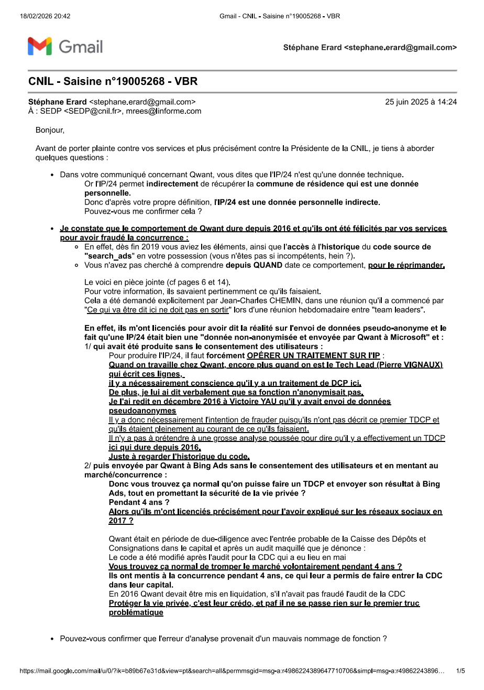

# Synthèse — Qwant : autopsie d'un simulacre souverain

## Comment la France a financé pendant douze ans un méta-moteur Bing, détruit la seule technologie souveraine réelle, et laissé prescrire les infractions à la protection des données.

Par **Stéphane Erard** — Lanceur d'alerte, ancien ingénieur Qwant — Mars 2026

---

## Résumé exécutif

Ce dossier documente comment, pendant deux décennies, la France a investi massivement dans un simulacre de moteur de recherche souverain (Qwant), tout en laissant détruire la seule technologie souveraine réelle (Xaphir, développée par Xilopix).

Il repose sur deux témoignages complémentaires :
- **Stéphane Erard** : ancien ingénieur de Qwant qui a constaté de l'intérieur la dépendance totale à Bing et la transmission de données non anonymisées
- **Éric Mathieu** : cofondateur de Xilopix, qui documente la destruction délibérée de sa technologie par le même écosystème politico-financier qui soutenait Qwant

---

## Chiffres clés

| Indicateur | Qwant | Xilopix |
|-----------|-------|---------|
| **Durée** | 12 ans (2013-2025) | 8 ans R&D (2008-2017) |
| **Dépendance technologique** | 100 % Bing | Technologie souveraine |
| **Part de marché réelle** | 0,5-1 % | N/A (détruite) |
| **Investissement initial** | Centaines de M€ publics | 10 M€ |
| **Valeur retenue** | 70 M€ (valorisation CDC 2017) | 180 000 € (rachat 2017) |
| **Équipe** | 77 personnes (8 mois) | 38 personnes, 8 docteurs |
| **Dette totale** | 24 M€ | N/A |
| **Pertes (2017)** | 17 M€ | N/A |
| **Chiffre d'affaires (2017)** | 2,9 M€ | N/A |
| **Coûts de fonctionnement (8 mois)** | 15,5 M€ | N/A |

---

## PARTIE I — LE SIMULACRE QWANT

### La dépendance totale à Microsoft Bing

De 2013 à 2025, **100 % des résultats de recherche de Qwant provenaient de l'API Bing de Microsoft**. Qwant n'a jamais développé de crawler, d'indexeur, ni d'algorithme de classement propre. Le « moteur de recherche souverain français » était, dans les faits, une interface graphique posée sur les serveurs de Microsoft.

Cette réalité était connue de certains acteurs de l'écosystème dès 2013. Des experts et forums spécialisés avaient immédiatement qualifié Qwant de « méta-moteur ». Pourtant, Qwant a continué à se présenter publiquement comme un moteur souverain, bénéficiant du soutien actif de l'État.

**Preuves techniques documentées :**

- En **août 2015**, l'application mobile Qwapp a révélé la dépendance technique totale à l'API Bing
- En **juin 2016**, un audit réalisé par Cardiweb a tenté de masquer cette réalité : l'API Bing avait été désactivée la veille de l'audit pour simuler l'existence d'une technologie propriétaire

### La violation massive de la vie privée

Qwant se présentait comme le champion de la protection des données personnelles. Son slogan — **« le moteur de recherche qui respecte votre vie privée »** — était au cœur de sa communication et de sa proposition de valeur auprès des investisseurs publics.

La réalité était diamétralement opposée. **Les données de recherche des utilisateurs étaient transmises à Microsoft sans anonymisation.** Chaque requête effectuée sur Qwant partait vers les serveurs de Bing aux États-Unis, avec les données d'identification de l'utilisateur.

Ce fait est documenté par :
- Des captures d'écran
- Des analyses réseau
- Des pièces techniques présentes dans le dossier de Stéphane Erard

**Le système webBrainLocales**, utilisé en interne, traitait des données de localisation fine des utilisateurs. Cette pièce technique constitue une preuve supplémentaire du non-respect des engagements de Qwant en matière de vie privée.

### Les chiffres accablants : comptes annuels 2017

Le contraste est saisissant : **Qwant a consommé en 8 mois de fonctionnement ce que Xilopix a investi en 9 ans de R&D réelle, pour un résultat technologique nul.**

| Métrique | Montant | Contexte |
|---------|---------|---------|
| **Coûts de fonctionnement** | 15,5 M€ | Pour 77 personnes, 8 mois |
| **Chiffre d'affaires** | 2,9 M€ | En retrait massif des dépenses |
| **CA à l'étranger** | 72 % du CA | Sans présence commerciale à l'étranger |
| **Pertes** | 17 M€ | Déficit structurel |
| **Dette totale** | 24 M€ | Insolvabilité de facto |
| **Comptes analysés** | 2017 | Disponibles au greffe du tribunal de commerce |

---

## PARTIE II — LA DESTRUCTION DE XILOPIX/XAPHIR

### Une véritable technologie souveraine

**Xilopix a été fondée en 2008 à Épinal par Éric Mathieu.** En huit ans de développement, l'entreprise a bâti :

- **Une équipe de 38 personnes** : 9 nationalités, 11 langues parlées
- **31 développeurs** incluant 8 docteurs en informatique
- **Partenariats publics majeurs** : Sept laboratoires de recherche étaient associés au projet
  - CNRS
  - INRIA
  - CEA-LIST
  - IMT (Institut Mines-Télécom)

**La technologie développée** était brevetée et représentait une rupture dans le domaine de la recherche :
- Moteur de recherche visuelle et tactile
- Algorithmes de classement propriétaires
- Infrastructure de crawl et d'indexation indépendante
- **Investissement total : 10 millions d'euros**

**Le moteur Xaphir a été mis en ligne en mai 2017.** Sur certaines requêtes, il égalait voire surpassait Google en pertinence des résultats. C'était, à cette date, **la seule véritable technologie souveraine de recherche sur le web développée en France.**

### Le mécanisme d'élimination : quatre phases documentées

#### Phase 1 : Assèchement des financements (mai 2016)

En **mai 2016**, quand Xilopix a sollicité la Caisse des Dépôts pour un financement, **Gabriel Gauthey, directrice de l'investissement numérique à la CDC, a refusé tout audit de la technologie.** La raison invoquée : une « file d'attente ».

Parallèlement, les financements régionaux se sont asséchés, vraisemblablement sous l'influence de la CDC et de bpifrance.

#### Phase 2 : L'audit frauduleux de Cardiweb (20 juin 2016)

Le **20 juin 2016**, un audit de Qwant a été réalisé par la société Cardiweb. **La veille de cet audit, l'API Bing a été masquée pour simuler l'existence d'une technologie propriétaire.** Cet audit frauduleux a servi de justification à l'investissement de la CDC dans Qwant.

#### Phase 3 : Investissement CDC dans Qwant (31 janvier 2017)

Le **31 janvier 2017**, la CDC a investi dans Qwant sur une valorisation fantaisiste de **70 millions d'euros** pour une société qui affichait :
- 24 millions de dette
- 17 millions de pertes

Quelques jours avant, le **12 janvier 2017**, les structures Angels 1 et Angels 2 avaient été créées pour réorganiser l'actionnariat, avec Éric Léandri désigné président irrévocable.

#### Phase 4 : Rachat et liquidation de Xilopix (10 novembre 2017)

Le **10 novembre 2017**, Qwant a racheté Xilopix pour **180 000 euros** — soit **1,8 % des 10 millions d'euros investis.**

**Immédiatement après le rachat, Xaphir a été retiré d'Internet.** Aucun audit technique n'a été réalisé sur la technologie acquise. L'équipe a été dispersée. Le site d'Épinal a été fermé.

Comme le documente Éric Mathieu dans son rapport de 87 pages, cette séquence événementielle ne relève pas de la malchance ou de l'incompétence. **Elle constitue un mécanisme délibéré d'élimination d'un concurrent réel au profit d'un simulacre.**

---

## PARTIE III — LA DÉFAILLANCE DE L'ÉTAT

### Les mensonges publics documentés

Plusieurs hauts responsables politiques ont relayé publiquement les allégations de Qwant, contribuant à maintenir le simulacre :

#### Éric Léandri (cofondateur et PDG de Qwant)
**Fausses déclarations devant le Sénat de la République** sur les capacités technologiques propriétaires de Qwant. La transcription de son audition constitue un document de référence pour établir la réalité du parjure.

#### Cédric O (secrétaire d'État au Numérique)
A affirmé au salon Vivatech et devant le Sénat que :
- Qwant était un moteur souverain
- Qwant disposait d'une part de marché significative

**Les deux affirmations étaient fausses.** La part de marché réelle n'a jamais dépassé 1 %.

Par ailleurs, Cédric O occupait la fonction de **trésorier de La République En Marche** au moment où les structures Angels 1 et 2 étaient créées (12 janvier 2017), avant l'investissement CDC (31 janvier 2017).

#### Bruno Le Maire (ministre de l'Économie)
A vanté Qwant auprès de la commissaire européenne Margrethe Vestager, présentant l'entreprise comme un exemple de souveraineté numérique européenne.

#### Jean-Michel Blanquer (ministre de l'Éducation nationale)
A imposé le déploiement de **Qwant Junior dans les écoles de la République.** Un constat d'huissier avait pourtant démontré que ce service **traçait les enfants.**

#### DINUM (Direction interministérielle du numérique)
A rédigé une note sur Qwant qui n'a jamais été publiée intégralement.

### Les montages financiers et connexions politiques

Le **12 janvier 2017**, deux structures baptisées **Angels 1 et Angels 2** ont été créées, avec Éric Léandri désigné président irrévocable. **Soixante-six associés y ont transféré 351 895 actions Qwant, représentant 17 % du capital de l'entreprise.**

**Parmi les associés de ces structures figurent des personnalités politiques et du monde des affaires :**
- Philippe Douste-Blazy (ancien ministre)
- Claude Berda (producteur audiovisuel)
- Joël Cicurel
- Frédéric Gaubert

Le dossier d'Éric Mathieu documente également :
- Le rôle de Sébastien Ménard
- Les liens avec Alexandre Benalla
- La présence de la structure Bad Boys dans les Paradise Papers

**La coïncidence temporelle entre :**
- La création de ces structures (12 janvier 2017)
- L'investissement de la CDC (31 janvier 2017)
- La campagne présidentielle de 2017
- Cédric O comme trésorier de LREM

**...soulève des questions qui n'ont jamais reçu de réponse.**

### La Caisse des Dépôts : un rôle central et accablant

La CDC, bras financier de l'État, a joué un rôle central à chaque étape de cette affaire :

1. **Elle a refusé d'auditer la technologie réelle** (Xilopix)
2. **Elle a investi dans le simulacre** (Qwant) sur la base d'un audit frauduleux
3. **Elle a contribué à l'assèchement des financements** de Xilopix via sa coordination avec bpifrance
4. **Elle a cautionné une valorisation de 70 millions d'euros** pour une société financièrement exsangue

Ce comportement pose la question de la **responsabilité fiduciaire de la CDC dans la gestion des fonds publics** qu'elle est censée protéger.

---

## PARTIE IV — LA DÉFAILLANCE DE LA CNIL

### Plainte déposée (2019)

En **2019**, Stéphane Erard a déposé plainte auprès de la CNIL (Commission nationale de l'informatique et des libertés) pour **transmission de données personnelles non anonymisées à Microsoft sans le consentement des utilisateurs de Qwant.**

La plainte était documentée par des preuves techniques :
- Captures d'écran
- Analyses réseau
- Pièces issues du système interne de Qwant

Elle portait sur une **violation caractérisée du RGPD** (Règlement général sur la protection des données), entré en vigueur en mai 2018.

### Clôture sans sanction (février 2025)

En **février 2025** — **six ans après le dépôt de la plainte** — la CNIL a clôturé le dossier sans avoir prononcé la moindre sanction. **Le motif invoqué est la prescription des faits.**

### Trois problèmes majeurs

Ce dénouement soulève trois problèmes majeurs :

#### Inertie délibérée
Une autorité de régulation ne peut à la fois prendre six ans pour traiter un dossier et invoquer ensuite la prescription. Cette séquence suggère une inertie volontaire plutôt qu'une simple lenteur administrative.

#### Signal envoyé aux entreprises
Si une violation massive du RGPD peut rester impunie par le simple écoulement du temps, c'est l'ensemble du dispositif de protection des données qui est décrédibilisé. Les entreprises apprennent que la prescription est une stratégie viable.

#### Signal envoyé aux lanceurs d'alerte
Déposer une plainte documentée n'a servi à rien. Aucune enquête approfondie. Aucune sanction. Aucun signalement au parquet. C'est un message décourageant pour les futurs lanceurs d'alerte.

---

## PARTIE V — LE PARCOURS DU LANCEUR D'ALERTE

### Stéphane Erard

**Ingénieur en informatique**, a travaillé chez Qwant où il a constaté de l'intérieur les deux réalités que l'entreprise dissimulait :
1. La dépendance totale à Microsoft Bing
2. La transmission de données non anonymisées

### Tentative d'alerte interne

Il a d'abord tenté d'alerter en interne. Face à l'absence de réponse, il a déposé plainte auprès de la CNIL en 2019.

### Rendre publiques les constatations

Il a également rendu publiques ses constatations pour informer :
- Les investisseurs publics
- Les utilisateurs
- L'opinion publique

de la réalité du service.

### Licenciement

**Il a été licencié par Qwant en 2021**, faisant suite à l'alerte lancée en interne et à la plainte CNIL.

### Documentation exhaustive

Son dossier est étayé par **plus de 200 pages de documentation technique**, incluant :
- Captures d'écran
- Analyses réseau
- Pièces justificatives

compilées dans un document intitulé **« Petit précis d'une escroquerie en bande organisée »**.

### Corroboration par Éric Mathieu

Son témoignage est corroboré et complété par celui d'**Éric Mathieu**, cofondateur de Xilopix, qui a publié en septembre 2020 un rapport de 87 pages documentant la destruction de sa société et de sa technologie.

**Les deux dossiers convergent et se complètent :**
- L'un documente le simulacre vu de l'intérieur
- L'autre la machination vue de l'extérieur

---

## PARTIE VI — DEMANDES

### 1. Commission d'enquête parlementaire

Stéphane Erard demande l'ouverture d'une **commission d'enquête parlementaire** portant sur :
- L'utilisation des fonds publics versés à Qwant
- Le rôle de la Caisse des Dépôts dans l'investissement et dans l'élimination de Xilopix
- Les déclarations publiques des responsables politiques ayant garanti la souveraineté d'une technologie inexistante

### 2. Reconnaissance du statut de lanceur d'alerte

Conformément à :
- La loi Sapin II (loi n° 2016-1691 du 9 décembre 2016)
- La directive européenne 2019/1937 sur la protection des personnes qui signalent des violations du droit de l'Union

Stéphane Erard demande la **reconnaissance officielle de son statut de lanceur d'alerte**.

### 3. Réouverture du dossier CNIL

La prescription des faits ne fait pas disparaître la réalité des faits. Stéphane Erard demande que :
- Les infractions au RGPD soient officiellement établies
- Même si la sanction n'est plus possible
- Les circonstances ayant conduit à six ans d'inaction de la CNIL soient examinées

---

## Annexes et sources

### Sources documentaires principales

- **« Petit précis d'une escroquerie en bande organisée »** — Stéphane Erard, 200+ pages (document Notion)
- **Rapport Xilopix/Qwant** — Éric Mathieu, 87 pages (septembre 2020)
- **Réponse CNIL** — Courrier de clôture (février 2025)
- **Pièce technique webBrainLocales** — Preuves de traitement de données de localisation
- **Comptes annuels Qwant 2017** — Disponibles au greffe du tribunal de commerce
- **Constats d'huissier** — Traçage des enfants par Qwant Junior
- **Articles de presse** — La Lettre A (« Datas, procès et paradis fiscaux : le délicat droit d'inventaire de Qwant », juillet 2020)
- **Documents judiciaires** — Conclusions d'appel Erard c/ Qwant

---

## Navigation

**Précédent :** [Sommaire](./00_SOMMAIRE.md) | **Suivant :** [02 Chronologie](./02_CHRONOLOGIE.md)

---

Document compilé par **Stéphane Erard** — Mars 2026 — Contact : stephane.erard@proton.me
