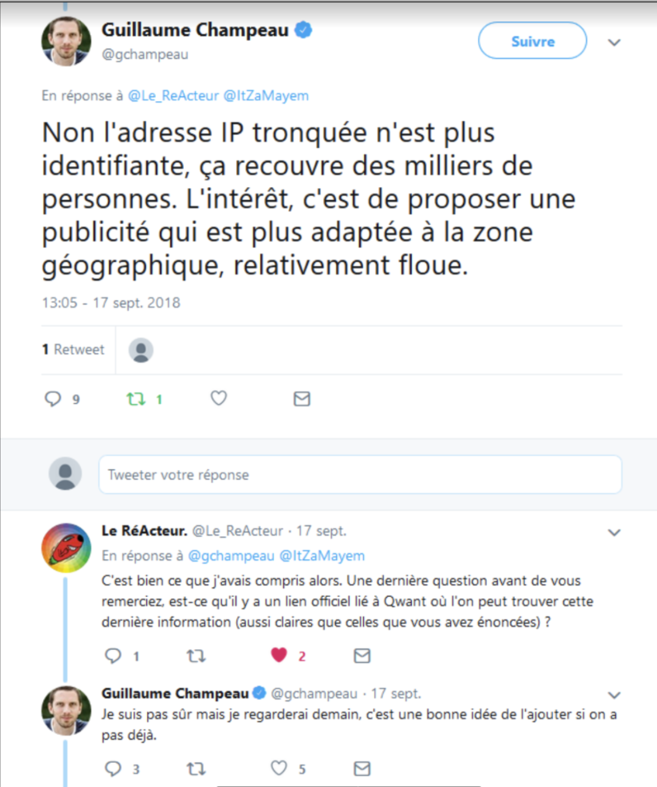
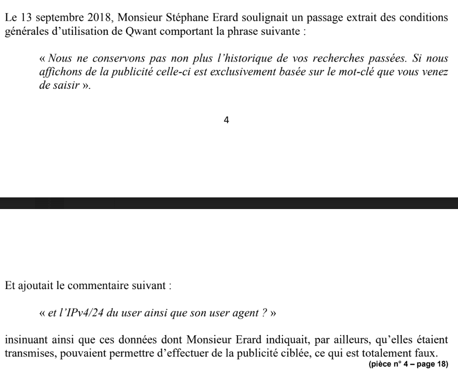
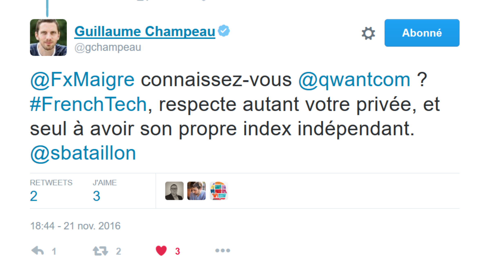
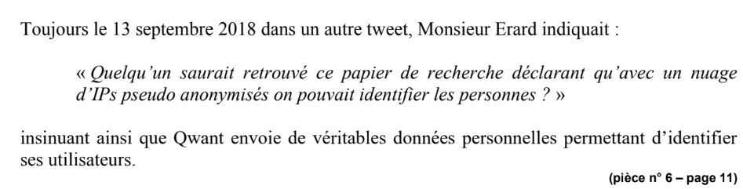
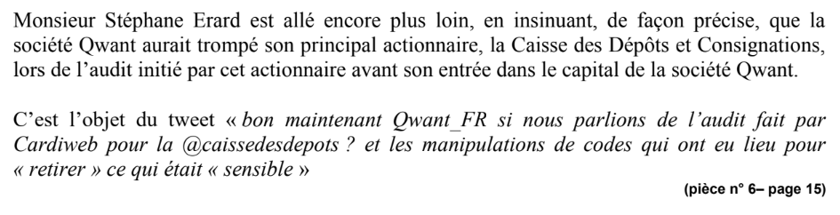
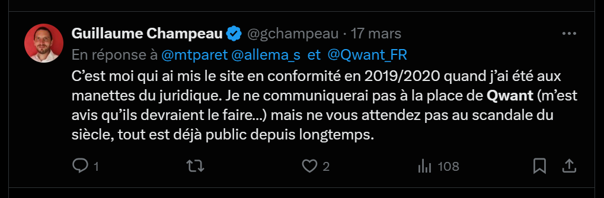

# Accusations de Qwant vs Réalité — Les 15 accusations démontées

**Document consolidé — Stéphane Erard — Mars 2026**

[← Sommaire](00_SOMMAIRE.md) | [← CNIL](05_CNIL_VALIDATION.md) | [SLAPP →](07_SLAPP_REPRESAILLES.md)

---

## Table des matières

Ce document consolide l'intégralité des accusations formulées par Qwant aux prud'hommes (2018), en appel (2019) et aux tribunaux, confrontées à la réalité établie par la décision CNIL de février 2025.

- **PARTIE I** — Tableau synthétique des 6 objectifs stratégiques et des 15 accusations
- **PARTIE II** — Analyse détaillée des 15 accusations (format standardisé)
- **PARTIE III** — Chaîne logique globale de la stratégie Qwant
- **PARTIE IV** — Annexe : inventaire brut des accusations

---

## PARTIE I — LA STRATÉGIE GLOBALE DE QWANT

### Chaîne logique imposée par Qwant

La stratégie de Qwant repose sur un postulat unique : **les faits dénoncés par Erard sont faux**.

```
« Faits faux »
    ↓
« Tweets mensongers »
    ↓
« Tweets déloyaux »
    ↓
« Abus de liberté d'expression »
    ↓
« Licenciement justifié »
    ↓
« Protection lanceur d'alerte inapplicable »
```

**Le premier maillon a cédé en février 2025.**

La CNIL a établi que :

✔ Les données transmises à Microsoft étaient bien **pseudonymes** (et non anonymes)
✔ La politique de confidentialité de Qwant était **inexacte et incomplète**
✔ Qwant manquait à ses obligations de transparence (articles 12 et 13 du RGPD)
✔ La finalité publicitaire de l'envoi à Microsoft **n'était pas communiquée** aux utilisateurs

**Résultat : toute la chaîne s'effondre.**

---

### Les 6 objectifs stratégiques de Qwant

| **OBJECTIF STRATÉGIQUE** | **MOYENS DÉPLOYÉS** | **ACCUSATIONS** |
|---|---|---|
| **Nier les faits** | Affirmer que les violations RGPD n'existent pas | N°1, 2, 3, 7 |
| **Requalifier l'alerte en faute** | Transformer la dénonciation en dénigrement, déloyauté, violation du secret | N°7, 8, 9, 10 |
| **Intimider et faire taire** | Citation en diffamation, clause-bâillon, effet SLAPP | N°9, 11, 12 |
| **Décrédibiliser le lanceur d'alerte** | Minimiser le rôle technique, contester la classification | N°10, 13, 15 |
| **Éliminer les preuves gênantes** | Disqualifier les témoins, occulter le rôle de la DPO | N°13, 14 |
| **Priver de protection légale** | Empêcher la qualification de lanceur d'alerte | N°4, 8, 12 |

---

## PARTIE II — ANALYSE DÉTAILLÉE DES 15 ACCUSATIONS

---

### Accusation N°1 — Aucune donnée personnelle transmise à Bing

**Ce que Qwant affirme :**
Qwant prétend ne transmettre aucune donnée personnelle à Microsoft/Bing. « Cette utilisation des ressources Bing se fait sans rien céder sur la spécificité du moteur de recherche Qwant, à savoir l'absence de tracking, et l'absence de conservation ou de transmission des données personnelles » (Conclusions CPH, p.3). « Ces violations n'existent pas » (CPH, p.12).

**Objectif stratégique :**
Rendre les propos d'Erard mensongers par postulat.

**La réalité :**
La CNIL établit en février 2025 que les données transmises à Microsoft Ireland étaient **pseudonymes** (et non anonymes) : « les données transmises ne pouvaient pas être qualifiées d'anonymes mais le terme pseudonymes était le plus exact ». Rappel aux obligations pour manquement aux articles 12 et 13 du RGPD (transparence et information). Les faits dénoncés par Erard étaient **VRAIS**.


**Sources :**
- Courrier de clôture CNIL (Présidente Denis), saisine n°19005268
- Conclusions Qwant CPH p.3 et p.12
- Conclusions en appel p.14

**✅ Verdict :**
Les faits dénoncés par Erard étaient VRAIS.

---

### Accusation N°2 — L'IP tronquée (IP/24) est anonyme

**Ce que Qwant affirme :**
En appel, Qwant développe un argumentaire technique : l'IP/24 serait anonymisée, et le user-agent (navigateur, OS) ne serait pas une donnée personnelle. « Seule l'adresse IP est une donnée personnelle, mais elle est anonymisée puisqu'elle est tronquée » (Appel, p.14-15). « Ni le logiciel d'accès à Internet ni le système d'exploitation d'un ordinateur ne sont des données personnelles ».

**Objectif stratégique :**
Rendre les alertes d'Erard techniquement infondées.

**La réalité :**
La CNIL a analysé le dispositif et conclu que malgré les mesures de Qwant, les données transmises à Microsoft n'étaient que **pseudonymisées**. Une IP tronquée reste une donnée à caractère personnel au sens du RGPD. La combinaison IP/24 + user-agent permet une réidentification. Le Conseil d'État (arrêt JC Decaux, 8 février 2017) avait déjà jugé que la troncature d'un identifiant unique n'était pas suffisante pour anonymiser. Le Groupe de travail Article 29 (2014) : « Les requêtes transmises à un moteur de recherche, couplées avec les adresses IP ou d'autres paramètres, ont un potentiel d'identification très élevé ».




**Sources :**
- Décision CNIL 2025
- Conseil d'État, arrêt JC Decaux, 8/02/2017
- Avis du Groupe de travail Article 29, n°05/2014
- Conclusions en appel p.14-15
- Réponse d'Erard à la CNIL, juin 2025

**✅ Verdict :**
Pseudonymisation ≠ anonymisation. Erard avait raison.

---

### Accusation N°3 — Politique de confidentialité exacte et complète

**Ce que Qwant affirme :**
Qwant présente sa politique de confidentialité comme exacte et complète. « Qwant fait en sorte de ne pas envoyer de données personnelles de ses utilisateurs, et de ne pas permettre des publicités ciblées et le tracking » (Conclusions Appel, p.14).

**Objectif stratégique :**
Présenter l'entreprise comme irréprochable en matière RGPD.

**La réalité :**
La CNIL constate que la politique de confidentialité était **inexacte et incomplète** : ne mentionnait pas la finalité publicitaire de la transmission à Microsoft, ne mentionnait pas la base légale du traitement, qualifiait les données d'« anonymes » au lieu de « pseudonymes », les versions italienne et allemande différaient des versions FR/EN. Manquement aux articles 12 et 13 du RGPD.



**Sources :**
- Courrier de clôture CNIL, 2025

**✅ Verdict :**
Politique de confidentialité trompeuse, confirmée par la CNIL.

---

### Accusation N°4 — Rejet du statut de lanceur d'alerte

**Ce que Qwant affirme :**
La Cour d'appel juge que les tweets « ne relèvent pas d'une information objective sur les pratiques de l'entreprise » et que les « considérations sur l'absence d'anonymisation complète mais d'un système de pseudonymisation sont inopérantes » (Arrêt CA Aix, 10/03/2022).

**Objectif stratégique :**
Priver Erard de toute protection légale (article L.1132-3-3 du Code du travail).

**La réalité :**
C'est précisément cette distinction pseudonymisation/anonymisation que la Cour a jugée « inopérante » qui a conduit la CNIL à sanctionner Qwant trois ans plus tard. Erard avait saisi la CNIL en 2019 sur ces mêmes faits. La CNIL a constaté les manquements. Erard invoquait l'article L.1132-3-3 du Code du travail (protection des lanceurs d'alerte).

**Sources :**
- Arrêt CA Aix-en-Provence, 10/03/2022
- Décision CNIL, février 2025
- Article L.1132-3-3 du Code du travail

**✅ Verdict :**
La CNIL a validé ce que la Cour d'appel jugeait « inopérant ».

---

### Accusation N°5 — Qwant n'est PAS un proxy de Bing

**Ce que Qwant affirme :**
Qwant affirme avoir « sa propre indexation et ses propres réponses aux requêtes des internautes, réponses qui sont seulement complétées par des réponses données par Bing » (CPH, p.12). La Cour d'appel retient que « rien ne permet de considérer que ce recours était d'ampleur ».

**Objectif stratégique :**
Minimiser la dépendance à Bing pour invalider l'alerte.

**La réalité :**
Le partenariat Bing couvrait la quasi-totalité des résultats Web et la totalité des publicités (modèle économique entier). Article Mediapart (2013) : Qwant avait « massivement recours à Bing pour fournir des résultats sans qu'il en ait été fait mention lors du lancement » (repris par l'arrêt d'appel). La FAQ de Qwant n'a été mise à jour qu'en septembre 2016, et la FAQ Search Lite n'était toujours pas mise à jour en décembre 2016. L'historique du code source confirme le retrait puis la remise du code Bing autour de l'audit CDC.



**Sources :**
- Conclusions CPH p.12
- Arrêt CA Aix-en-Provence
- Réponse LRAR d'Erard
- Articles de presse 2013 (Mediapart)
- Historique du code source (search_ads)

**✅ Verdict :**
Le modèle économique entier reposait sur Bing.

---

### Accusation N°6 — Le « fake call » était un simple test technique

**Ce que Qwant affirme :**
Qwant prétend en appel que la modification du code avant l'audit CDC était « un test afin de montrer les capacités autonomes de son moteur de recherche, en excluant d'une recherche tous résultats en provenance de Bing ». Question rhétorique : « Comment peut-on penser qu'un contrat essentiel, mentionné dans les pages du site de Qwant, soit caché à un investisseur ».

**Objectif stratégique :**
Réfuter l'accusation de fraude à l'audit CDC.

**La réalité :**
Mails internes de juin 2016 (pièce n°10 au correctionnel) : des salariés déclarent explicitement avoir modifié le code source pour dissimuler la collecte et la transmission à Bing avant l'audit. Jean-Charles Chemin a ouvert la réunion par : « Ce qui va être dit ici ne doit pas en sortir » (attesté par Erard dans sa réponse à l'avertissement et dans sa réponse à la CNIL). L'historique du code source (search_ads) montre le retrait puis la remise du code d'appel Bing après l'audit.


**Sources :**
- Conclusions en appel p.17
- Mails internes, juin 2016
- Réponse d'Erard à l'avertissement
- Réponse d'Erard à la CNIL, 2025
- Historique du code source

**✅ Verdict :**
Preuves documentaires de la dissimulation délibérée.

---

### Accusation N°7 — Les tweets sont « dénigrants et mensongers »

**Ce que Qwant affirme :**
Qwant qualifie les tweets d'Erard d'« insinuations dénigrants de faits totalement faux » et de « dénigrement public par voie d'insinuations ». Invoque la jurisprudence de la Cour de Cassation (29/11/2006 et 29/04/2009) sur l'abus de liberté d'expression par insinuations et sous-entendus injurieux. « Rien ne peut justifier ces insinuations dénigrants de faits totalement faux » (Conclusions Appel).

**Objectif stratégique :**
Requalifier l'alerte en faute disciplinaire.

**La réalité :**
La CNIL confirme en 2025 exactement ce qu'Erard dénonçait : données pseudonymes présentées comme anonymes, politique de confidentialité trompeuse, manquement RGPD. Les « violations » que Qwant niait catégoriquement ont été constatées par l'autorité compétente. La prémisse centrale de Qwant (« faits faux ») est détruite.




**Sources :**
- Conclusions Qwant CPH p.12
- Conclusions en appel p.13-14
- Décision CNIL, février 2025

**✅ Verdict :**
La prémisse centrale de Qwant (« faits faux ») est détruite.

---

### Accusation N°8 — Violation de l'obligation de loyauté

**Ce que Qwant affirme :**
Les tweets constituent un manquement à l'obligation de loyauté car ils « mettent en doute la sincérité des déclarations publiques de la société ». Même en arrêt maladie, les déclarations se rattachent à la vie professionnelle.

**Objectif stratégique :**
Transformer le questionnement légitime en faute contractuelle.

**La réalité :**
Erard n'a pas dénigré : il a alerté sur des pratiques réelles. La CNIL a confirmé que Qwant présentait ses données pseudonymes comme anonymes. L'obligation de loyauté du salarié ne peut servir à couvrir des manquements de l'employeur au RGPD et envers les investisseurs publics. Dénoncer des pratiques illégales n'est pas de la déloyauté.

**Sources :**
- Conclusions Qwant CPH p.11-12
- Conclusions en appel p.12-13
- Article L.1132-3-3 du Code du travail

**✅ Verdict :**
Dénoncer des pratiques illégales n'est pas de la déloyauté.

---

### Accusation N°9 — Violation de l'obligation de confidentialité

**Ce que Qwant affirme :**
Erard viole l'article 14 de son contrat qui l'astreint au « secret professionnel le plus absolu » en évoquant les rapports contractuels Qwant/Microsoft.

**Objectif stratégique :**
Utiliser la clause contractuelle comme baillon.

**La réalité :**
Le partenariat Qwant/Bing était **PUBLIC depuis 2013**. Articles Le Figaro, Mediapart, WebRankInfo dès 2013. Qwant le mentionnait elle-même sur qwant.com et dans sa politique de protection des données. Erard répond dans son LRAR : « il me semble évident qu'une entreprise passe des partenariats [...] Je n'ai à aucun moment dévoilé quelque contrat que ce soit ». On ne peut violer la confidentialité d'une information publique.



**Sources :**
- Conclusions CPH p.12
- Conclusions en appel
- Réponse LRAR d'Erard
- Articles de presse 2013 (Le Figaro, Mediapart, WebRankInfo)
- Site qwant.com

**✅ Verdict :**
On ne peut violer la confidentialité d'une information publique.

---

### Accusation N°10 — Erard a reconnu être l'auteur des tweets

**Ce que Qwant affirme :**
Au CPH : pseudonyme « lol@serard » = pseudonyme transparent. Erard ne s'est pas rendu à l'entretien préalable et n'a pas contesté dans sa réponse LRAR. En appel : production d'un nouveau tweet de janvier 2019 (pce n°19) où Erard déclare : « J'ai écrit sous mon nom. Cela m'a valu un licenciement. @Qwant_FR ».

**Objectif stratégique :**
Empêcher toute contestation de l'authorship et montrer la récidive.

**La réalité :**
La question n'est pas QUI a tweeté, mais si les faits sont vrais. La CNIL a répondu OUI. Déplacer le débat sur l'identité de l'auteur est une stratégie d'évitement du fond. L'authorship ne change rien à la véracité des faits.

**Sources :**
- Conclusions CPH
- Conclusions en appel
- Constat huissier du 02/03/2017

**✅ Verdict :**
L'authorship ne change rien à la véracité des faits.

---

### Accusation N°11 — Citation en diffamation au TGI de Paris

**Ce que Qwant affirme :**
Élément ajouté en appel : Qwant a fait citer Erard devant le TGI pour diffamation et injures publiques. Effet recherché : créer un élément à charge supplémentaire et un effet d'intimidation.

**Objectif stratégique :**
Procédure-bâillon (SLAPP) pour décourager l'alerte.

**La réalité :**
Les conclusions en défense d'Erard soulèvent l'irrecevabilité de la citation pour défaut de notification au ministère public (art. 53 loi du 29/07/1881). Qwant n'a pas rapporté la preuve de cette notification. Sur le fond, les tweets ne constituent ni diffamation ni injure : absence d'imputation de faits précis portant atteinte à l'honneur, et simple critique légitime d'un service. Procédure-bâillon contre un lanceur d'alerte.

**Sources :**
- Conclusions en défense d'Erard, TGI Paris
- Article 53 de la loi du 29/07/1881
- Article 29 de la loi de 1881

**✅ Verdict :**
Procédure-bâillon contre un lanceur d'alerte.

---

### Accusation N°12 — Visibilité des tweets (4ème rang Qwant/social)

**Ce que Qwant affirme :**
En appel, Qwant fait valoir que les tweets apparaissaient au 4ème rang dans Qwant/social (pièce n°16, juillet 2018), donc avaient un impact réel sur l'image de l'entreprise. Cite la jurisprudence de Toulouse (24/03/2017).

**Objectif stratégique :**
Aggraver la faute en insistant sur l'audience.

**La réalité :**
La visibilité d'une vérité n'en fait pas une faute. Le fait que des propos véridiques soient visibles ne constitue pas une faute. Au contraire, la protection des lanceurs d'alerte protège précisément la divulgation publique de manquements. Plus l'information est importante pour le public, plus sa diffusion est légitime. **Intérêt public > intérêt commercial de Qwant.**

**Sources :**
- Conclusions en appel
- Loi Sapin II sur les lanceurs d'alerte

**✅ Verdict :**
Intérêt public > intérêt commercial de Qwant.

---

### Accusation N°13 — Harcèlement moral inexistant

**Ce que Qwant affirme :**
Erard « ne produit strictement aucun élément permettant même de présumer l'existence du harcèlement ». Le mail de Chemin est « écrit dans des termes amicaux ». En appel : disqualification du témoin Montaut (licenciée pour faute lourde en 2017, n'a pas contesté) ; production d'un e-mail de Chemin du 12/04/2016 pour montrer qu'il était « à l'écoute ».

**Objectif stratégique :**
Retourner les preuves de tension en preuves de bienveillance ; éliminer les preuves testimoniales défavorables.

**La réalité :**
Erard décrit dans sa réponse au 1er avertissement un épisode de violence physique de J.-C. Chemin : « il s'en est pris physiquement à ma personne, en fonçant sur moi, me prenant fortement par ses poignets pour me retourner » devant l'open-space. Propos de Chemin rapportés : « gratte-papier cégétiste », insultes envers fonctionnaires et cheminots. L'avertissement du 7/09/2016 a été donné pendant l'arrêt maladie, sans citer les tweets reprochés ni fournir de captures. Christophe Bourrelly (collaborateur lié à Qwant) a été **CONDAMNÉ par le TJ de Paris le 27/01/2021** pour injures publiques envers Erard. Le fait qu'un témoin ait été licencié n'invalide pas juridiquement son attestation. Chronologie cohérente : alerte → avertissement → licenciement.


**Sources :**
- Conclusions CPH p.13
- Conclusions en appel
- Avertissement du 07/09/2016
- Réponse d'Erard à l'avertissement
- Jugement du Tribunal judiciaire de Paris, 27/01/2021

**✅ Verdict :**
Chronologie cohérente : alerte → avertissement → licenciement.

---

### Accusation N°14 — Engagements vie privée respectés / Rôle de la DPO

**Ce que Qwant affirme :**
Qwant prétend que ses engagements en matière de vie privée étaient respectés et que tout était en ordre. Qwant n'a jamais évoqué le rôle de sa DPO dans ses conclusions, ni son absence de moyens.

**Objectif stratégique :**
Occulter la défaillance du contrôle interne.

**La réalité :**
Conversation Erard/Yau (décembre 2016) : la DPO était informée de l'envoi de données pseudo-anonymisées à Bing. Yau reconnaît que l'ajout de Bing dans les FAQ « semble avoir été fait après [la] mise en arrêt maladie » d'Erard. Yau affirme à tort que « on n'envoie rien à Bing, c'est eux qui récupèrent l'IP » — contredit par le code source. Erard : « au sens de la CNIL, les infos pseudo-anonymisées ne sont pas des infos anonymisées » — confirmé par la CNIL en 2025. La DPO n'avait accès ni au code source, ni au contrat Microsoft, ni au payload des données transmises.



**Sources :**
- Conversation Erard/Yau, décembre 2016
- Code source search_ads
- Décision CNIL, février 2025
- Profil LinkedIn de Victoire Yau

**✅ Verdict :**
La DPO elle-même confirmait les faits dénoncés par Erard.

---

### Accusation N°15 — Contestation du repositionnement en classification 3.2

**Ce que Qwant affirme :**
Qwant conteste qu'Erard ait exercé des fonctions d'encadrement justifiant la classification 3.2 de la convention Syntec. « N'avait aucune responsabilité de commandement sur des collaborateurs et cadres ». Fait valoir que son salaire (3 533,33 €) était déjà supérieur au minimum conventionnel de la position 3.1.

**Objectif stratégique :**
Minimiser le rôle d'Erard et sa connaissance technique pour réduire la crédibilité de l'alerte.

**La réalité :**
Ce grief vise à réduire le statut professionnel d'Erard pour minimiser implicitement la portée et la crédibilité de ses connaissances techniques sur les pratiques internes de Qwant. La position 3.3 (plus adaptée que 3.2) ne requiert pas de commandement hiérarchique mais valorise les « très larges initiatives » et la « grande valeur technique » — exactement le profil d'Erard (52 projets, formation des équipes, audit CDC). Stratégie de minimisation du lanceur d'alerte.

**Sources :**
- Conclusions CPH
- Conclusions en appel
- Convention Syntec
- Revalorisation Syntec 3.3

**✅ Verdict :**
Stratégie de minimisation du lanceur d'alerte.

---

## PARTIE III — CONCLUSION GÉNÉRALE

**Chronologie factuelle :**

- **2016** : Erard dénonce les manquements au RGPD (tweets, conversations internes)
- **09/2016** : Avertissement sans détails spécifiques
- **03/2017** : Licenciement décidé
- **2017-2019** : Procédures prud'hommes et appel — Qwant dénigrement et fautes
- **2019** : Erard saisit la CNIL sur les mêmes faits
- **02/2025** : La CNIL valide exactement ce qu'Erard dénonçait

**Stéphane Erard a été licencié en 2017, qualifié de menteur aux prud'hommes, et cité en diffamation pour avoir dénoncé exactement ces faits.**

**La décision de la CNIL lui donne raison sur le fond, huit ans après sa plainte.**

---

## PARTIE IV — ANNEXE : INVENTAIRE BRUT DES ACCUSATIONS

### A. Accusations aux Prud'hommes (CPH Nice, 2 mars 2018)

**Source :** Conclusions de la société Qwant, audience de mise en état du 2 mars 2018, CPH Nice, Section Encadrement. Avocat : Maître Laurent Salem.

| N° | Intitulé | Contenu |
|---|---|---|
| 1 | Dénigrement public de l'employeur sur Twitter | Tweets du 25/08/2016 insinuant que Qwant ne respecterait pas la vie privée. Prise de contact avec employé Microsoft Bing. Conséquence : avertissement du 7/09/2016. |
| 2 | Récidive : tweets du 1er mars 2017 | Constatés par huissier le 2/03/2017. Mise en doute du respect de la vie privée, insinuation proxy Bing, moquerie des déclarations de Léandri, mise en doute de la rentabilité, tentative de dissuader un professeur. |
| 3 | Manquement à l'obligation de loyauté | Les tweets « mettent en doute la sincérité des déclarations publiques de la société ». Accusations « totalement fausses » selon Qwant. |
| 4 | Violation de l'obligation de confidentialité | Article 14 du contrat : « secret professionnel le plus absolu ». Insinuations sur les rapports contractuels Qwant/Microsoft. |
| 5 | Mélange d'éléments publics et d'allégations fausses | Mélange de l'existence connue du partenariat Bing avec « le prétendu non-respect de l'engagement de non-utilisation et de non-transmission des données personnelles ». |
| 6 | Rejet du harcèlement moral | Preuves insuffisantes : un seul e-mail « dans des termes amicaux » et un arrêt maladie mentionnant « stress aigu ». Jamais de plainte pendant la relation de travail. |
| 7 | Rejet de la demande de repositionnement (3.2) | « Aucune responsabilité de commandement sur des collaborateurs et cadres ». Salaire déjà supérieur au minimum 3.1. |

---

### B. Accusations en Appel (Cour d'Appel Aix-en-Provence, 23 juillet 2019)

**Source :** Conclusions d'intimée de la société Qwant, RPVA du 23 juillet 2019, Chambre 4-4. Avocats : Maîtres Caroline de Foresta (postulante) et Laurent Salem (plaidant).

**Éléments renforcés ou nouveaux :**

| N° | Intitulé | Contenu |
|---|---|---|
| 1R | Preuve de la paternité des tweets (renforcée) | Pseudonyme « lol@serard » transparent. Pas de contestation dans réponse LRAR ni au CPH. Tweet de janvier 2019 : « J'ai écrit sous mon nom. Cela m'a valu un licenciement. @Qwant_FR » (pce n°19). |
| 2R | Tweets dénigrants et mensongers (renforcée) | Argumentaire technique : IP/24 = anonymisée, user-agent pas une donnée personnelle, mots recherchés non personnels. |
| 3N | Dissuasion d'un professeur (nouvelle) | Erard aurait tenté de dissuader un professeur d'utiliser Qwant avec ses élèves : « comportement déloyal qui n'est en aucune manière justifié ». |
| 4N | Trouble objectif causé à l'entreprise (nouvelle) | Tweets au 4ème rang Qwant/social (pce n°16). Jurisprudence Toulouse 24/03/2017. Mention de la citation en diffamation (TGI Paris, 17ème chambre, pce n°18). |
| 5N | Continuation du dénigrement après licenciement (nouvelle) | « Attaques quasi quotidiennes » ayant conduit à la citation en diffamation. |
| 6R | Rejet du harcèlement moral (renforcée) | Disqualification attestation Montaut (licenciée faute lourde 2017). « Fake call » = test technique. Mail Cassar à Vignaux (Erard en copie seulement). E-mail Chemin 12/04/2016 montrant qu'il était « à l'écoute ». |

---

### C. Qualification juridique retenue par Qwant

Qwant a qualifié le licenciement de « motif réel et sérieux » (et non de faute grave), en invoquant cumulativement :

- Le manquement à l'obligation de discrétion absolue contractuelle (article 14 du contrat)
- Le manquement à l'obligation de loyauté caractérisé par des tweets « tendant à insinuer auprès du public que Qwant trompait le public sur ses résultats de recherche et sur le respect de la vie privée de ses utilisateurs »
- L'abus dans l'exercice de la liberté d'expression

---

### D. Sources documentaires principales

| Source | Date | Référence |
|---|---|---|
| Conclusions Qwant CPH Nice | 2 mars 2018 | Section Encadrement, Avocat Laurent Salem |
| Conclusions Qwant Appel | 23 juillet 2019 | CA Aix-en-Provence, Chambre 4-4 |
| Arrêt CA Aix-en-Provence | 10 mars 2022 | Rejet du pourvoi d'Erard |
| Décision CNIL | Février 2025 | Saisine n°19005268, Présidente Denis |
| Réponse Erard CNIL | Juin 2025 | Réaction à la décision CNIL |

---

## Navigation

[← Sommaire](00_SOMMAIRE.md) | [← CNIL](05_CNIL_VALIDATION.md) | [SLAPP →](07_SLAPP_REPRESAILLES.md)

---

**Document compilé par Stéphane Erard — Mars 2026**
**Contact : stephane.erard@proton.me**

*Cette documentation consolide l'intégralité des accusations formulées par Qwant et leur confrontation aux faits établis par l'autorité compétente.*
