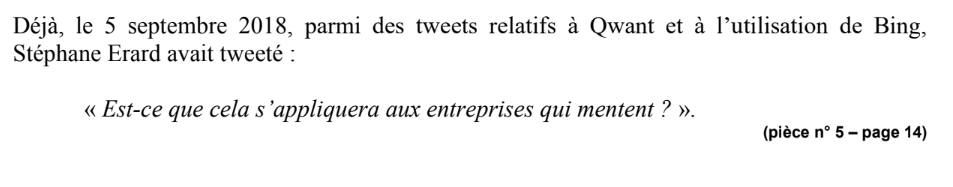
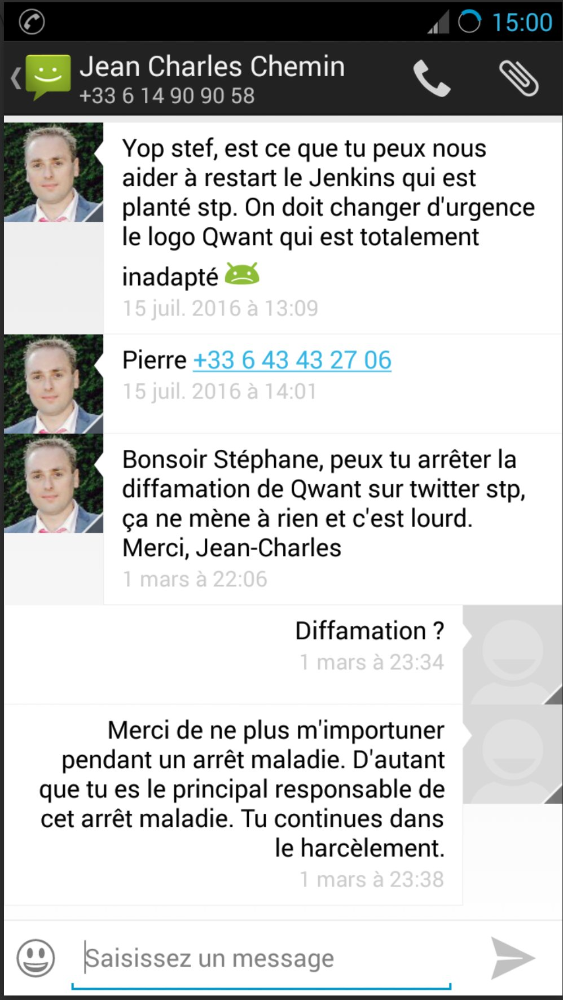

# SLAPP et représailles systématiques contre le lanceur d'alerte

**Document établi le 28 février 2026**

---

## 1. Objet de ce document

Le présent document établit la stratégie systématique de représailles et de harcèlement procédural déployée par Qwant, son dirigeant Éric Léandri et leurs proches à l'encontre de Stéphane Erard, lanceur d'alerte. Il démontre que cette stratégie, caractéristique d'une procédure-bâillon (SLAPP — Strategic Lawsuit Against Public Participation), a placé le lanceur d'alerte dans une situation de vulnérabilité extrême l'empêchant matériellement d'exercer ses droits et de poursuivre les procédures pénales que les faits justifiaient.

---

## 2. Inventaire chronologique des représailles (2016–2022)

| DATE | ÉVÉNEMENT | NATURE |
|------|-----------|--------|
| Août 2016 | Agression physique et verbale de JC Chemin en open-space : foncé sur Erard, saisi par les poignets, insulté de « gratte-papier cégétiste », menace « lui je vais me le faire ». | Violence physique |
| Août 2016 | Arrêt maladie pour dépression sévère, conséquence directe de l'agression. | Conséquence santé |
| Sept. 2016 | Premier avertissement disciplinaire fondé sur les tweets dénonçant les pratiques de Qwant. | Sanction disciplinaire |
| Pendant arrêt | Qwant fait en sorte que le dossier de maintien de salaire d'Erard ne soit pas traité (témoignage A. Montaut). | Épuisement financier |
| Pendant arrêt | Léandri décrédibilise Erard auprès des collègues, attaque ses opinions politiques. | Harcèlement moral |
| Janv. 2017 | SMS de Chemin après entrée CDC au capital : « ça ne sert à rien » de « diffamer » Qwant, « les jeux sont faits ». | Intimidation |
| Mars 2017 | Second avertissement fondé sur des tweets constatés par huissier. | Sanction disciplinaire |
| 15 mai 2017 | Licenciement pour « faute grave ». Motif : tweets dénonçant la dépendance à Bing et l'envoi de données non anonymisées. | Licenciement représailles |
| 2017 | Citation directe devant le TGI pour diffamation publique et injure publique fondée sur les mêmes tweets. | Procédure-bâillon |
| Mai 2019 | Campagne d'injures publiques de Laurent Bourrelly (ami de Léandri, « Advisor Qwant ») sur Twitter. | Campagne harcèlement |
| Juill. 2018 | ALD 100 % reconnue par la CPAM pour dépression sévère (jusqu'au 02/07/2028). | Conséquence santé |
| 2018–2022 | Procédure prud'homale + appel : Qwant soutient que « ces violations n'existent pas » et qualifie Erard de menteur. | Fraude judiciaire |

---

## 3. La procédure-bâillon (SLAPP) : citation en diffamation

### 3.1. Les faits

Qwant a cité directement Stéphane Erard devant le Tribunal de Grande Instance pour diffamation publique et injure publique (loi du 29 juillet 1881), sur le fondement des mêmes tweets qui motivaient par ailleurs son licenciement. Cette citation visait des tweets posant des questions techniques légitimes sur le traitement des données par Qwant (adresses IP, user agent, lien avec Bing) et des commentaires sur l'audit CDC/Cardiweb.

L'irrecevabilité de la citation a été obtenue par Me Ronan Hardouin, avocat d'Erard au pénal, pour défaut de notification au ministère public (art. 53 de la loi du 29/07/1881). Me Hardouin a également démontré sur le fond que les tweets ne constituaient ni diffamation ni injure : absence d'imputation de faits précis portant atteinte à l'honneur, et simple critique légitime d'un service participant d'un débat d'intérêt public. Me Hardouin a qualifié la démarche de Qwant de tentative de « procédure bâillon ».

### 3.2. La qualification de procédure-bâillon (SLAPP)

Une procédure-bâillon (SLAPP — Strategic Lawsuit Against Public Participation) est une action judiciaire engagée non pour obtenir gain de cause sur le fond, mais pour intimider, épuiser financièrement et réduire au silence une personne exerçant sa liberté d'expression sur un sujet d'intérêt public.

En l'espèce, tous les critères sont réunis :

| CRITÈRE SLAPP | APPLICATION AU CAS D'ESPÈCE |
|---------------|---------------------------|
| **Action visant la liberté d'expression** | Les tweets visés posaient des questions techniques légitimes sur le traitement des données par un moteur de recherche financé par des fonds publics. |
| **Sujet d'intérêt public** | Protection des données de millions d'utilisateurs, utilisation de 15M€ de fonds publics, souveraineté numérique. |
| **Absence de fondement sur le fond** | Me Hardouin a démontré l'absence d'imputation diffamatoire. La CNIL a confirmé en 2025 que les faits dénoncés par Erard étaient vrais. |
| **Disproportion des moyens** | Qwant : SAS financée par la CDC (15M€), assistée de Me Laurent Salem. Erard : salarié licencié, en dépression sévère, sans revenus. |
| **Effet d'intimidation** | Double front : pénal (diffamation) + prud'hommes (licenciement) simultanés. Erard devait se défendre sur deux procédures avec des avocats différents. |
| **Résultat : silence du lanceur d'alerte** | Erard n'a pas pu engager les procédures pénales que les faits justifiaient (escroquerie aux subventions, fraude à l'audit). |

---

## 4. La campagne de harcèlement de Laurent Bourrelly

### 4.1. Les faits

Les 12 et 13 mai 2019, Laurent Bourrelly a publié sur Twitter une série d'injures publiques contre Stéphane Erard, notamment :

- « À part emmerder le monde, t'as fait quoi concrètement de ta misérable vie ? »
- « T'es un gros nul qui n'a jamais rien fait de sa vie et qui veut prendre un chèque sans rien glander. Toxique comme on en fait rarement. »
- « Le seul qui s'est incrusté pour rien branler et se foutre en arrêt maladie longue durée c'est toi. Toxique, minable et fainéant. »

### 4.2. Condamnation

Par jugement du 27 janvier 2021, le Tribunal judiciaire de Paris (Présidente Delphine Chauchis) a jugé que ces propos constituaient une injure publique et a condamné Laurent Bourrelly à verser 3 000 € de dommages-intérêts et 2 000 € au titre de l'article 700. Le tribunal a constaté que ces propos « dépassent largement les limites admissibles de la liberté d'expression ».

### 4.3. Liens documentés Bourrelly / Léandri / Qwant

Les liens entre Bourrelly et Léandri sont documentés par de multiples sources publiques :

| SOURCE | CONTENU |
|--------|---------|
| **Blog Bourrelly** | Bourrelly qualifie Léandri de « mon ami Éric Léandri, fondateur de Qwant » à plusieurs reprises. |
| **Next (Next.ink)** | Rapporte que Bourrelly qualifie Léandri de « mon ami » et le décrit comme « Advisor de Qwant ». |
| **Le Média (18/05/2020)** | « Éric Léandri reçoit aussi le soutien de son ami Laurent Bourrelly, un temps conseiller chez Qwant. » |
| **SEO By Night 2019** | Compte-rendu mentionnant Léandri intervenant et « orchestration » par Bourrelly. |
| **Assignation TGI Paris** | « Il travaille depuis près de deux ans pour la société QWANT » (non contesté en défense). |

Ces éléments permettent raisonnablement d'imputer à Léandri la responsabilité de la campagne de harcèlement. La note de Bourrelly révélant les méthodes managériales de Léandri (« éruptif », « violemment colérique », « agressif » — Mediapart) confirme un schéma général d'intimidation.

---

## 5. Conséquences sur le lanceur d'alerte

### 5.1. Effondrement de santé

L'agression physique de Chemin en août 2016, suivie du licenciement, de la citation en diffamation et de la campagne Bourrelly, ont provoqué chez Stéphane Erard une dépression sévère médicalement reconnue. Il bénéficie depuis le 1er juillet 2018 d'une prise en charge au titre de l'Affection de Longue Durée (ALD) à 100 % par la CPAM des Alpes-Maritimes, reconduite jusqu'au 2 juillet 2028. Soit plus de 10 ans de dépression sévère directement imputable aux représailles.

### 5.2. Destruction familiale et sociale

Les représailles ont entraîné la perte de sa famille, de son emploi, de son réseau professionnel et de sa capacité à reconstruire sa vie. L'isolement provoqué par le combat inégal contre une entreprise soutenue par des investisseurs publics a profondément altéré sa santé mentale et sa capacité à agir.

### 5.3. Impossibilité matérielle d'exercer ses droits

C'est précisément l'effet recherché par une stratégie SLAPP : non pas gagner sur le fond, mais rendre l'adversaire incapable de se battre.

---

## 6. Cadre juridique applicable

### 6.1. Protection des lanceurs d'alerte contre les représailles

L'article L.1132-3-3 du Code du travail (loi du 6 décembre 2013, applicable au moment des faits) protège tout salarié ayant relaté, de bonne foi, des faits constitutifs d'un délit ou d'un crime. La loi Sapin II du 9 décembre 2016 (art. 6 à 16) renforce cette protection. La loi Waserman du 21 mars 2022 (transposant la directive UE 2019/1937) élargit encore le dispositif et instaure des sanctions spécifiques contre les procédures-bâillons (art. 225-1 du Code pénal modifié).

### 6.2. La directive européenne anti-SLAPP

La directive (UE) 2024/1069 du 11 avril 2024 relative à la protection contre les procédures judiciaires manifestement infondées visant les personnes participant au débat public (directive anti-SLAPP) doit être transposée par les États membres avant le 7 mai 2026. Elle prévoit notamment la possibilité de rejet accéléré des actions manifestement infondées et la condamnation aux frais de la partie ayant introduit une procédure abusive.

### 6.3. L'impossibilité d'agir comme préjudice indemnisable

L'impossibilité matérielle d'engager des procédures pénales constitue elle-même un préjudice indemnisable sous deux angles : la perte de chance d'avoir pu agir au pénal dans les délais (le lanceur d'alerte aurait pu déposer plainte pour escroquerie aux subventions publiques si ses moyens le lui avaient permis), et le préjudice d'isolement et de vulnérabilité (le coût des représailles l'a placé dans l'incapacité de faire valoir ses droits, ce qui constitue une atteinte au droit d'accès au juge garanti par l'article 6§1 de la CEDH).

---

## 7. Synthèse de la stratégie de Qwant : 6 objectifs stratégiques

La consolidation des accusations de Qwant révèle 6 objectifs stratégiques servant un seul but : réduire au silence le lanceur d'alerte et préserver le financement public.

| OBJECTIF | MOYENS | ACCUSATIONS |
|----------|--------|-----------|
| **Nier les faits** | Affirmer que les violations RGPD n'existent pas | N°1, 2, 3, 7 |
| **Requalifier l'alerte en faute** | Transformer la dénonciation en dénigrement, déloyauté, violation du secret | N°7, 8, 9, 10 |
| **Intimider et faire taire** | Citation en diffamation, SLAPP, double front judiciaire | N°9, 11, 12 |
| **Décrédibiliser le lanceur** | Minimiser le rôle technique, campagne Bourrelly, attaque réputation | N°10, 13, 15 |
| **Éliminer les preuves** | Disqualifier les témoins (Montaut), occulter la DPO (Yau) | N°13, 14 |
| **Priver de protection** | Empêcher la qualification de lanceur d'alerte | N°4, 8, 12 |

**Postulat central de Qwant :** « Les faits dénoncés par Erard sont faux. » La décision de la CNIL de février 2025 a fait effondrer ce postulat en constatant que les données transmises à Microsoft étaient bien pseudonymes (et non anonymes), que Qwant manquait à ses obligations de transparence, et donc que ce que Stéphane Erard dénonçait depuis 2016 était fondé.

---

## 8. Le coût des représailles : impossibilité d'agir

Les faits justifiaient des procédures pénales (escroquerie aux subventions publiques art. 313-1 CP, faux et usage de faux art. 441-1 CP, collecte frauduleuse de données art. 226-18 CP) et une saisine du Parquet National Financier.

Stéphane Erard n'a pas pu engager ces procédures pour trois raisons directement liées aux représailles :

1. **Épuisement financier** — Licencié pour faute grave (sans indemnités), il devait déjà financer simultanément sa défense aux prud'hommes et au pénal (diffamation).

2. **Épuisement psychologique** — Dépression sévère (ALD 100 %), conséquence directe de l'agression, du licenciement et du harcèlement.

3. **Isolement** — Perte de famille, de travail, d'entourage. Un lanceur d'alerte seul face à une entreprise soutenue par la Caisse des dépôts.

---

## 9. Stratégies de recours et procédures

| PROCÉDURE | APPORT |
|-----------|--------|
| **Prud'hommes** | Le licenciement s'inscrit dans un système de représailles documentable : agression → avertissements → licenciement → citation pénale → campagne Bourrelly. Renforce la nullité. |
| **Voie délictuelle** | Caractérise les fautes autonomes de Qwant et Léandri : SLAPP (abus de droit d'ester), harcèlement orchestré (Bourrelly), fraude judiciaire (dénégations devant la CA). Justifie le préjudice moral (80 000 €) et le préjudice spécifique lanceur d'alerte (50 000 €). |
| **Devoir de conseil (Avocate)** | L'état de vulnérabilité d'Erard (dépression sévère, double front judiciaire) renforçait le devoir de conseil de l'avocate. Elle aurait dû articuler le système de représailles dans ses conclusions (comme Me Hardouin l'a fait au pénal). |
| **Défenseur des droits** | Cas d'école de SLAPP contre un lanceur d'alerte isolé. L'impossibilité matérielle d'agir au pénal est la conséquence directe du coût des représailles. Justifie un accompagnement et une protection renforcée. |
| **Saisine CJIP ou PNF** | Si une plainte pénale est déposée (escroquerie 313-1 CP), le système de représailles contre le lanceur d'alerte constitue une circonstance aggravante et démontre la conscience du caractère frauduleux. |

---

## 10. Conclusion

Qwant et son dirigeant ont déployé une stratégie de représailles totale contre Stéphane Erard : agression physique, licenciement, citation en diffamation (procédure-bâillon), campagne d'injures orchestrée par un proche du dirigeant (Bourrelly, condamné), décrédibilisation systématique devant les juridictions, et obstruction au traitement de son dossier de maintien de salaire.

Ces représailles cumulées ont provoqué une dépression sévère (ALD 100 % depuis 10 ans), la perte de sa famille, de son emploi et de sa vie sociale. Elles l'ont placé dans l'impossibilité matérielle d'engager les procédures pénales que les faits justifiaient (escroquerie aux subventions publiques, faux, collecte frauduleuse de données).

Neuf ans plus tard, la CNIL a confirmé l'intégralité des faits dénoncés. Le lanceur d'alerte avait raison. La stratégie de Qwant n'avait qu'un seul objectif : le faire taire le temps de sécuriser 15 millions d'euros de fonds publics.

---

## Pièces jointes

- **Pièce A** — Jugement TJ Paris du 27/01/2021 condamnant Bourrelly pour injure publique (Minute n°41)
- **Pièce B** — Dossier d'indices publics de la relation Bourrelly / Léandri (blog, Next, Le Média, Synerweb, assignation)
- **Pièce C** — Conclusions en défense de Me Hardouin (procédure diffamation — qualification de « procédure bâillon »)
- **Pièce D** — Attestation de droits CPAM — ALD 100 % du 01/07/2018 au 02/07/2028 (dépression sévère)
- **Pièce E** — Réponse au 1er avertissement (description de l'agression physique de Chemin)
- **Pièce F** — Témoignage d'Alexandra Montaut (obstruction au dossier de maintien de salaire)
- **Pièce G** — Articles de presse : La Lettre A, Mediapart, Next Impact, Le Canard Enchaîné (méthodes managériales Léandri, « cahier de doléances » des salariés)

---

[← Sommaire](00_SOMMAIRE.md) | [← Accusations](06_ACCUSATIONS_VS_REALITE.md) | [Xilopix →](08_DESTRUCTION_XILOPIX.md)

---

Document compilé par Stéphane Erard — Mars 2026 — Contact : stephane.erard@proton.me
