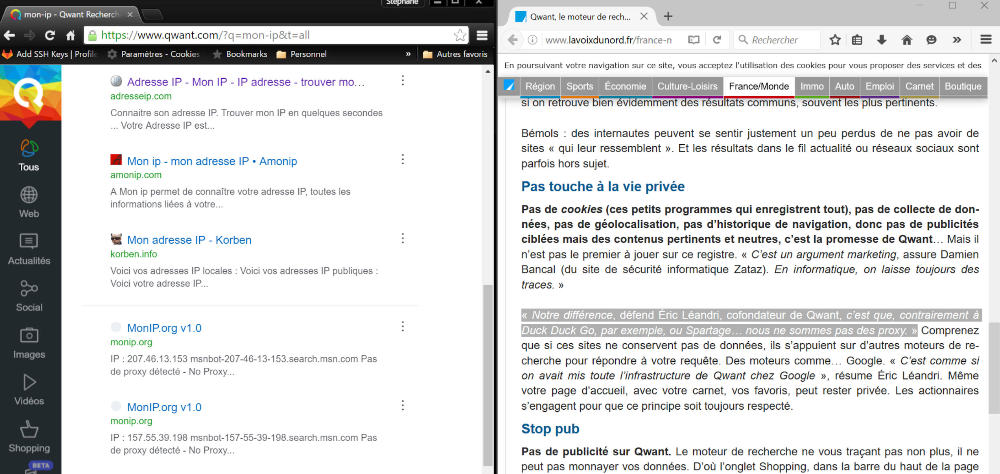
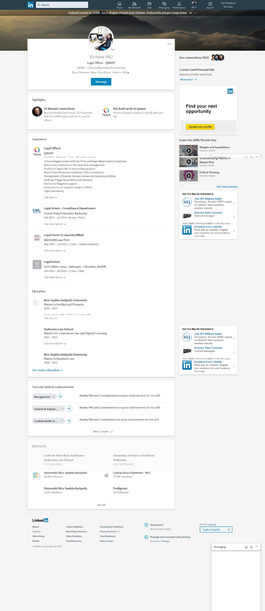
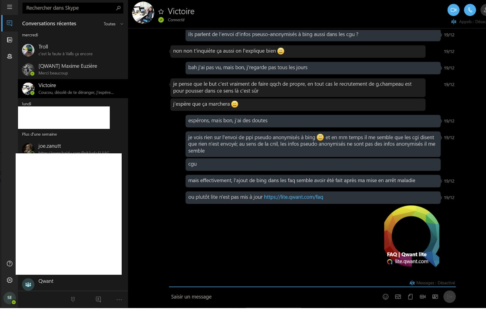
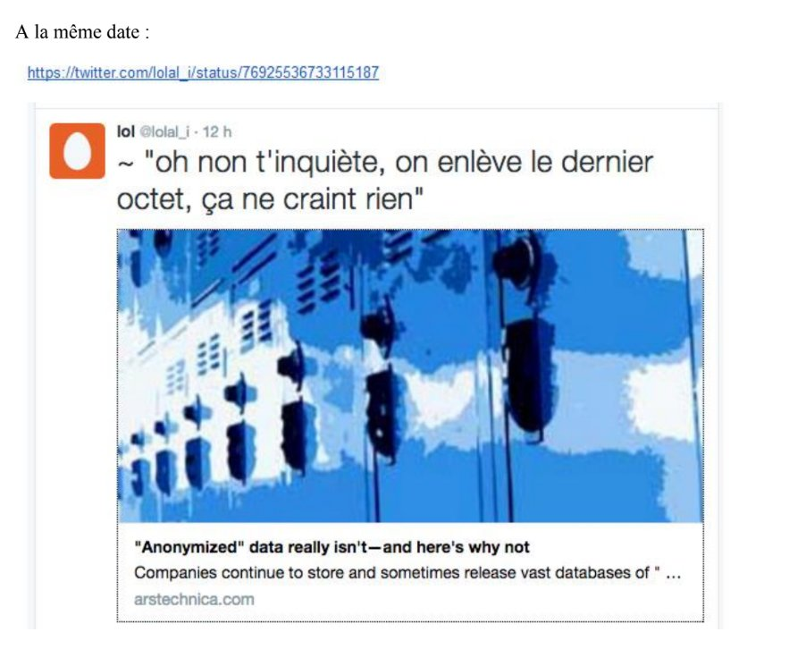

# 09. Analyse forensique détaillée — Le dépôt git API-API-TAG-PACKAGER

[← Sommaire](00_SOMMAIRE.md) | [← Précédent](08_DESTRUCTION_XILOPIX.md) | [Suivant →](10_AUDIT_DINUM_2019.md)

## Introduction

Le dépôt git du projet API-API-TAG-PACKAGER de Qwant constitue une preuve forensique d'une précision exceptionnelle du fonctionnement réel du moteur de recherche et de sa dépendance absolue à Bing/Microsoft.

Contrairement aux affirmations publiques de l'entreprise (« moteur souverain avec indexation propre »), l'analyse du code source et de l'historique des commits révèle une réalité fondamentalement différente : Qwant était un proxy de Bing, peuplé d'une couche de code capable de masquer cette réalité aux auditeurs, aux investisseurs et au public.

---

## I. La variable webBrainLocales : le cœur du routage des requêtes

### A. Contexte technique

Le code source de l'API principale de Qwant (api/qwant_v2, rebaptisée services/api) contenait un mécanisme de routage fondamental des requêtes web. Une variable appelée `webBrainLocales` définissait pour quelles langues les requêtes utilisateurs étaient envoyées au 'Brain' interne de Qwant (équipe Data) plutôt qu'à Bing (Microsoft).

**Logique du routage** :
- Si la locale de l'utilisateur était présente dans le tableau `webBrainLocales` → requête dirigée vers **WebBrain** (moteur propre de Qwant)
- Si la locale était absente du tableau → requête dirigée vers **Bing** (Microsoft)

Par conséquent, le **taux de dépendance à Bing = 1 - (probabilité que la locale soit dans le tableau)**.

### B. La commande git révélatrice

La commande `git log -GwebBrainLocales -p --reverse` sur le dépôt de référence révèle **5 commits modifiant cette variable entre le 22 juin et le 8 juillet 2016** — soit exactement pendant la période de l'audit CDC/CardiWeb.

### C. Le commit du 29 juin 2016 : la bascule vers Bing à 100%

**Auteur** : Pierre Vignaux
**Date** : 29 juin 2016
**Contenu** : Vidage complet du tableau webBrainLocales

```
webBrainLocales = []
```

Cet unique commit transforme le comportement de Qwant : 100% des requêtes Web sont désormais routées vers Bing. Aucune requête ne transite plus par le WebBrain. La façade de « moteur souverain » disparaît techniquement.

**Preuve de déploiement en production** : Ce commit apparaît dans des versions taguées (tags de versioning), confirmant que ce code a bien été déployé en production et n'était pas un artefact de développement.



---

## II. La manœuvre de dissimulation : déport de l'appel Bing

### A. La stratégie de l'opacification

Parallèlement à ce commit, une manœuvre technique sophistiquée a été mise en place pour rendre invisible l'appel à Bing :

1. **Jonathan Cassar (développeur)** a modifié l'API pour qu'elle n'appelle non plus Bing directement, mais le **WebBrain**.
2. **Thomas Massière** (équipe Data) a modifié le code de WebBrain (écrit en Java) pour y intégrer un **appel HTTP à Bing**.

**Résultat** : L'appel à Bing avait été déporté de l'API vers le WebBrain, le rendant invisible aux auditeurs et investisseurs lors de l'examen du code de l'API.

### B. La branche 'demo' de Cassar

Pour l'audit technique commandé par la CDC en mai 2016, Jonathan Cassar a créé une branche spéciale nommée `'demo'` du code source. Cette branche remplacait l'appel réel à Bing par un **« fake call »** au Brain, donnant l'apparence d'un moteur autonome alors que la version de production utilisait exclusivement Bing.

**Email de Cassar** (pièce d'audit) :
> « Comme demandé ce code est juste un fake »

Cette confession écrite établit que le code présenté aux auditeurs était volontairement falsifié.


### C. Le déploiement hors CI (Continuous Integration)

Thomas Massière (équipe Data) a déployé ses livrables hors de l'infrastructure d'intégration continue (CI) gérée par Stéphane Erard, c'est-à-dire **sans aucune traçabilité**. Il produisait des fichiers `.jar` (exécutables Java) qu'il déployait directement sur les serveurs, empêchant tout auditeur de savoir quel commit (version du code) avait réellement été audité.

### D. Implication des cadres dirigeants

**Chemin** (Responsable RH/Général) : C'est lui qui avait demandé aux employés de remonter les éléments « sensibles » avant l'audit, et qui avait envoyé l'email de préparation de l'audit.

**Corbi** (plus tard Délégué du Personnel) : En copie de l'email de Cassar, donc informé du caractère frauduleux de la branche « demo ».

---

## III. Envoi de données non-anonymisées à Bing Ads

### A. Le fichier search_ads.php : analyse détaillée

Le fichier `search_ads.php` est le composant qui gère l'affichage des publicités Bing Ads dans les résultats de recherche Qwant. L'analyse de ce fichier revèle l'**envoi systématique de trois éléments** à bingapis.com :

#### 1. L'adresse IPv4 tronquée au /24

- **Variable** : `$ipAddressAnonimized`
- **Fonction appelée** : `anonymizeIP()` (ligne 137)
- **Opération** : Remplace simplement le dernier octet par zéro
  - Exemple : `82.65.234.124` → `82.65.234.0`
- **Intégration** : L'adresse résultante est ajoutée à la requête envoyée à Bing Ads (ligne 156)

```php
// Extraction du code source
$ipAddressAnonimized = anonymizeIP($userIP);  // line 137
// ...
$bingAdsRequest = $apiClient->buildRequest([
    'ip' => $ipAddressAnonimized,
    'ua' => $userAgent,
    'q' => $searchQuery
]);  // line 156
```

#### 2. Le User-Agent (navigateur, système d'exploitation, version)

Transmis en clair à Microsoft, cet élément combiné à l'IP/24 constitue un **identifiant quasi-unique** (technique du « browser fingerprinting »).

#### 3. Les mots-clés de recherche (requête utilisateur)

Transmis en clair pour obtenir des publicités contextuelles.

### B. Pourquoi l'IPv4/24 n'est PAS une anonymisation

L'IPv4/24 conserve **les 3 premiers octets** de l'adresse IP complète. Cela représente un **sous-réseau de 254 adresses** (.1 à .254).

**Technique de ré-identification** : En interrogeant un service de géolocalisation sur chacune de ces 254 adresses, il est possible de **géolocaliser l'utilisateur au niveau du quartier**.

**Conclusion juridique** : Il s'agit de **pseudo-anonymisation**, non d'anonymisation au sens du RGPD.

### C. Le DataHub de traçabilité publicitaire

Le code source révèle également l'existence d'un **DataHub** qui envoie un message pour chaque publicité Bing Ads affichée. Ce **système de traçabilité interne** n'est mentionné nulle part dans la politique de confidentialité de Qwant.

**Implication** : Les utilisateurs ignorent que chaque requête générant une publicité est enregistrée avec les données associées :
- IPv4/24
- User-Agent
- Mots-clés de recherche

Ce système s'ajoute à l'envoi direct à Microsoft, créant une **double traçabilité** des activités utilisateurs.







---

## IV. L'agression physique de Chemin : contexte technique et chronologie

### A. Contexte socio-professionnel

**Le 9 mars 2016** : Jour de grève nationale. Stéphane Erard, le seul à faire grève chez Qwant, en informe son employeur dans les règles.

**Le 10 mars 2016** : La femme d'Erard accouche de leur premier enfant. Erard est mis en congé paternité.

**Le 30 mars 2016** : Chemin convoque Erard dans son bureau et lui tient des propos discriminatoires selon le statut d'affilié syndical :
> « Ici on travaille, on ne fait pas grève, on n'est pas la SNCF ou La Poste »

Ces propos, que Chemin n'a jamais démentis, même aux prud'hommes, constituent une **violation de la protection du droit de grève**.

### B. L'incident du 31 mars 2016 : recit détaillé

**Le 31 mars**, Erard envoie un email à Chemin pour :
- Formaliser les propos tenus la veille
- Prévenir qu'il fera grève l'après-midi

**La réaction de Chemin est immédiate et disproportionnée** :

**Phase 1 - Agression verbale dans l'open-space** :
- Chemin se lève violemment en hurlant : « Mais qu'est-ce qu'il me cherche celui-là »
- Il ouvre la porte et exige qu'Erard vienne dans son bureau
- Il se tourne vers l'équipe en criant : « GRATTE-PAPIER CEGETISTE »
- Ton humiliant, haut et devant tous les collègues en open-space

**Phase 2 - Intimidation dans le bureau** :
- Chemin continue à hurler pendant « des minutes interminables »
- Erard, se sentant menacé, quitte la pièce

**Phase 3 - Agression physique** :
- Alors qu'Erard rejoint son poste de travail, Chemin rouvre la porte en hurlant :
- « PUTAIN J'VAIS M'LE FAIRE C'LUI LA »
- Le menace de licenciement
- **Le saisit physiquement** et le retourne pour le faire partir des locaux
- Crie : « TU PRENDS TES CLICS ET TES CLACS ET TU TE TIRES »

**Phase 4 - Refus de quitter et retrait du harceleur** :
- Erard, effrayé, refuse de quitter les locaux pour ne pas être accusé d'abandon de poste
- Chemin finit par retourner dans son bureau en claquant violemment la porte

**Implication pour le dossier** : Cette agression crée un contexte de danger, d'intimidation et de violation de la liberté syndicale. Elle intervient exactement au moment où Erard commence à avoir conscience des problèmes techniques qu'il implémente pour Qwant.

---

## V. Synthèse : ce que prouvent ces éléments techniques

### A. Preuve de la dépendance à 100% à Bing

Le commit du 29 juin 2016 vidant complètement le tableau `webBrainLocales` constitue une **preuve irréfutable** que 100% des requêtes Web de Qwant étaient routées vers Bing. Aucun WebBrain. Aucune indexation propre. Aucun moteur souverain.

### B. Preuve de la fraude technique planifiée

Les actions parallèles de Cassar (branche demo), Massière (déport de l'appel Bing) et Chemin (demande de nettoyage des « éléments sensibles ») démontrent une **organisation délibérée** pour cacher la réalité aux auditeurs.

### C. Preuve de la transmission de données personnelles

Le code source de search_ads.php prouve que Qwant transmettait systématiquement à Microsoft :
- L'IP/24 (obtenue par traitement de l'IP complète)
- L'User-Agent
- Les mots-clés de recherche

Ces éléments combinés permettent une ré-identification de l'utilisateur et constituent une **violation du RGPD**, confirmée en février 2025 par la décision CNIL.

### D. Convergence avec les preuves administratives

Ces éléments techniques convergeront avec :
- L'audit DINUM de 2019 (confirmant la dépendance à Bing)
- La décision CNIL de février 2025 (confirmant les violations de données)
- Les aveux de Guillaume Champeau, ex-Directeur Éthique et Juridique (confirmant les mensonges de Léandri)

---

## VI. Conclusion de Layer 3

L'analyse forensique du dépôt git du projet API-API-TAG-PACKAGER établit définitivement que :

1. **Qwant n'avait pas de technologie propre** : 100% dépendant de Bing après juin 2016
2. **La fraude était organisée** : Modifications de code, branches « demo », déploiements non tracés
3. **Les données utilisateurs étaient transmises à Microsoft** : IPv4/24 + User-Agent + requête de recherche
4. **Les dirigeants en étaient conscients** : Emails de Cassar, demandes de Chemin, déploiements de Massière

Le code source ne ment pas. Les commits parlent d'eux-mêmes.

---

**Document compilé par Stéphane Erard — Mars 2026 — Contact : stephane.erard@proton.me**
