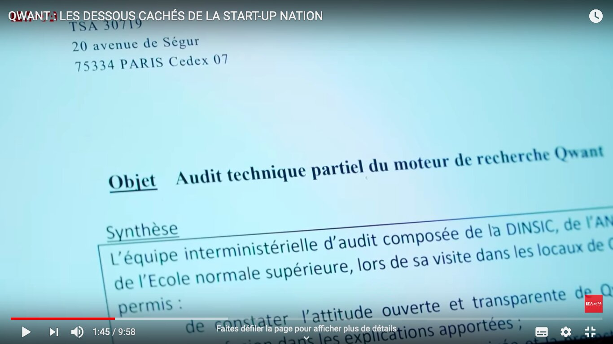
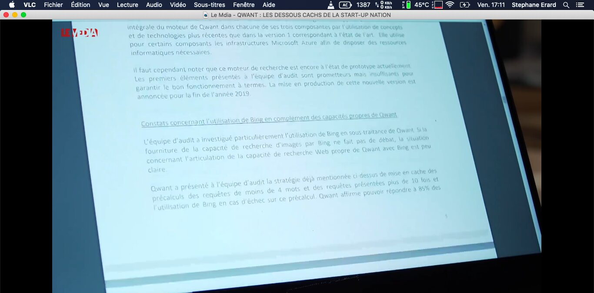
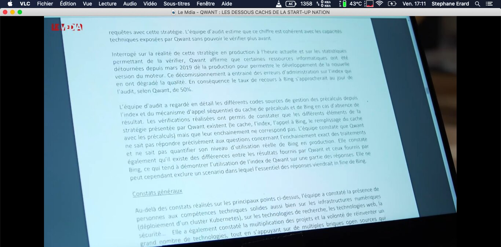
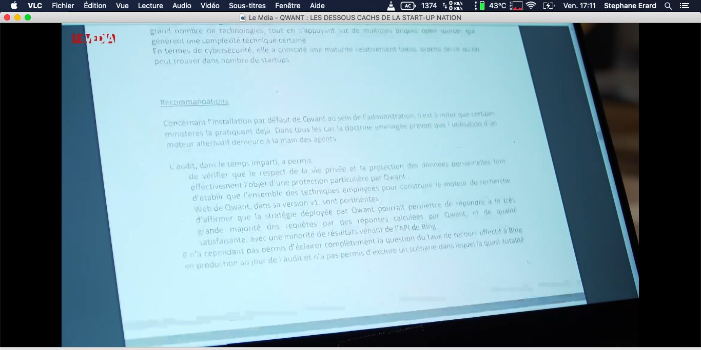
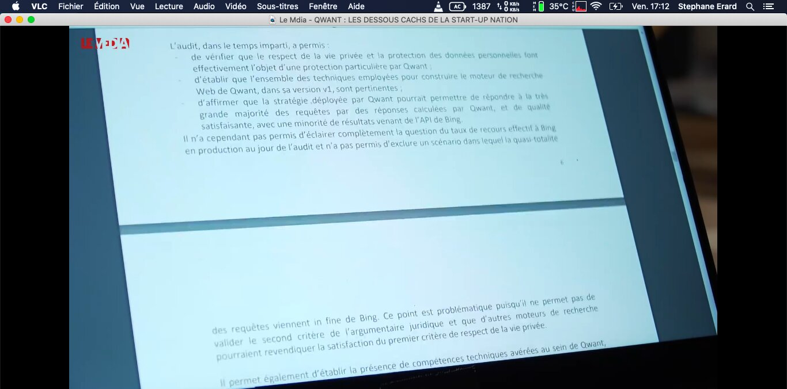

# 10. L'audit DINUM de 2019 — Corroboration institutionnelle

[← Sommaire](00_SOMMAIRE.md) | [← Précédent](09_FORENSIQUE_GIT.md) | [Suivant →](11_ANALYSE_FINANCIERE.md)

## Introduction

En juillet et septembre 2019, une équipe interministérielle composée d'agents de la DINUM (Direction interministérielle du numérique), de l'ANSSI (Agence nationale de la sécurité des systèmes d'information), du ministère des Armées et de l'École normale supérieure a conduit un audit technique de Qwant en vue de généraliser ce moteur de recherche comme outil par défaut dans l'administration française.

Cet audit constitue une **validation indépendante institutionnelle** des allégations de Stéphane Erard. Les auditeurs d'État ont découvert, par la suite d'une enquête technique rigoureuse, exactement ce que le lanceur d'alerte dénonçait depuis 2016.

---

## I. Contexte politique et mandat de l'audit

### A. La demande de Cédric O

Le secrétaire d'État au numérique, **Cédric O**, a demandé cet audit en vue de généraliser Qwant comme moteur de recherche par défaut dans l'administration française. Il s'inscrivait dans la continuité des initiatives de « souveraineté numérique » lancées après les révélations Snowden.

### B. Équipe d'auditeurs

- **DINSIC** (Agence du ministère de l'Économie chargée du numérique)
- **ANSSI** (Agence nationale de la sécurité des systèmes d'information)
- **Ministère des Armées**
- **École normale supérieure**

### C. Deux sessions d'audit

**Première session** : Fin juillet 2019, d'une journée, dans les locaux de Qwant à Paris.

**Deuxième session** : 25 septembre 2019, en quelques heures seulement.

### D. Publication et révélation

La note confidentielle résultant de cet audit, datée d'août 2019, a été révélée intégralement par le journaliste **Marc Endeweld** dans une enquête publiée le **18 mai 2020** dans Le Média (« Révélations : Qwant, boulet d'État »). Des éléments partiels avaient déjà été révélés par Acteurs Publics en janvier 2020.

---

## II. Les constats majeurs de la DINUM

### A. La « Version 2 fantôme »

La DINUM constate que Qwant développe une « nouvelle version » de son moteur de recherche, mais porte un jugement sévère sur son état :

**Constat** : La Version 2 est décrite comme un « prototype » non opérationnel et loin d'être prêt pour une utilisation en production.

**Implication** : Cela révèle que après **7 ans d'existence** et **plusieurs dizaines de millions d'euros investis**, Qwant n'avait pas de véritable moteur de recherche secondaire et restait entièrement dépendant de sa première version — elle-même basée sur Bing.

### B. Dépendance à Bing : « peu claire »

La note DINUM contient une section dédiée intitulée : **« Constats concernant l'utilisation de Bing en complément des capacités propres de Qwant »**

#### Observation des auditeurs

Les auditeurs expriment une **frustration évidente** face à l'opacité de Qwant concernant Bing. Après examen détaillé du code source, les composants existent mais ne fonctionnent pas comme présenté publiquement par l'entreprise.

#### Quantification impossible

**Constat clé** : Les auditeurs découvrent que **Qwant ne sait pas quantifier sa propre dépendance à Bing**. Une entreprise dépendante à 100% d'un moteur externe devrait pouvoir mesurer ce taux. L'incapacité à le faire est révélatrice : soit l'entreprise ment, soit elle n'a jamais eu de véritable moteur propre.

#### L'articulation Qwant/Bing est opaque

La note souligne que **l'articulation technologique entre Qwant et Bing n'est pas claire** et que **l'enchaînement présenté ne correspond pas à la réalité du code observé**.

### C. Conclusion du premier audit : dépendance quasi-totale non exclue

**Phrase décisive de la DINUM** :
> « Les éléments techniques examinés ne permettent pas d'exclure une dépendance quasi-totale à Bing »

Cette formulation diplomatique masque une réalité explosive : les auditeurs d'État **ne peuvent pas affirmer** que Qwant dispose d'une réelle autonomie technologique. L'inverse serait plus exact : tout indique une dépendance massive.

---

## III. Taux de dépendance mesuré

### A. Le second audit révélateur (25 septembre 2019)

Lors du second audit (25 septembre 2019), les auditeurs ont récupéré un document que Qwant avait désormais obligé de transmettre : un **« indicateur d'autonomie »** fourni par Qwant elle-même.

### B. Les chiffres accablants

**En juillet 2019** : Le taux de dépendance à Bing dépassait **75%**

**Fin septembre 2019** : Le taux était encore de **64%**

### C. Signification

Autrement dit, **sept ans après sa création**, le moteur de recherche « souverain » faisait traiter **les deux tiers de ses requêtes par Microsoft**. Et cela en septembre 2019, soit **après qu'Erard ait déposé plainte à la CNIL** (mars 2019) et **après les contrôles CNIL sur place** (août-septembre 2019), qui avaient probablement forcé Qwant à améliorer ses chiffres.

---

## IV. Le timing mars 2019 : plainte CNIL et « détournement de ressources »

### A. Chronologie révélatrice

Un passage de la note DINUM est particulièrement révélateur pour la compréhension chronologique du dossier :

**Mars 2019** : Stéphane Erard dépose plainte auprès de la CNIL contre Qwant pour **transmission de données non-anonymisées à Microsoft**.

**Août et septembre 2019** : La CNIL procède à deux contrôles sur place chez Qwant.

**Juillet et septembre 2019** : La DINUM audite Qwant et trouve un Qwant « propre » sur les données.

**Février 2025** : La CNIL confirme (décision du 10 février 2025, réf. MLD/VBR/CLA251094) que **les violations avaient bien existé avant le nettoyage**.

### B. Mécanisme de dissimulation

La chronologie est éloquente :
1. **Plainte Erard** → alerte Qwant
2. **Contrôles CNIL** → Qwant nettoie son code
3. **Audit DINUM** → trouve un Qwant « en conformité »
4. **Six ans plus tard** → CNIL confirme que les violations pré-nettoyage étaient réelles

**Conclusion** : Sans la plainte d'Erard, la DINUM aurait vraisemblablement constaté les violations de données que le lanceur d'alerte avait dénoncées depuis 2016.

---

## V. La vie privée : une validation en trompe-l'œil

### A. Conclusions positives sur la protection des données

La DINUM conclut positivement sur **la protection de la vie privée** :

> « Le respect de la vie privée est validé »

### B. Tempérament crucial

Cette conclusion est **immédiatement tempérée** par la phrase suivante :

> « Cependant, les constats concernant l'utilisation de Bing en complément des capacités propres demeurent non résolus »

### C. Le problème sous-jacent

La DINUM approuve la gestion des données, mais **ne peut pas approuver la souveraineté technologique**. En d'autres termes : les données peuvent être bien traitées, mais si le moteur de recherche lui-même est une filiale de Microsoft, l'intérêt de la souveraineté disparaît.

### D. Conclusion sur les alternatives

La DINUM conclut qu'**« autres moteurs pourraient revendiquer » le respect de la vie privée**, implicitement suggérant que ce n'est pas un facteur différenciant pour Qwant.

---

## VI. L'override politique : Cédric O et Olivier Sichel

### A. Non-respect des conditions

Malgré **les réserves explicites de la DINUM**, le secrétaire d'État Cédric O a annoncé en janvier 2020 **la généralisation de Qwant sur tous les postes informatiques de l'administration publique**, sans attendre que les trois conditions posées par les auditeurs soient remplies :

1. **Vérification dans les locaux de Qwant** des affirmations de remise en place de l'indexeur et de la mesure de 60% de dépendance à Bing
2. **Transmission quotidienne** à la DINSIC du taux de dépendance à Bing
3. **Acceptation d'une clause de revoyure** lors de la mise en place de la Version 2 du moteur, accompagnée d'un nouvel audit

**Résultat** : **Aucune** de ces trois conditions n'a été respectée.

### B. Faux témoignage de Sichel

En décembre 2019, **Olivier Sichel**, directeur général adjoint de la Caisse des Dépôts et patron de la Banque des Territoires, a déclaré devant la Commission de l'Assemblée nationale que :

> « Qwant respecte la vie privée et dispose d'un moteur autonome »

Il s'appuyait sur les « bons retours » de l'audit DINUM.

**Omission volontaire** : Il a omis de mentionner que :
- Qwant envoyait des données pseudo-anonymisées à Microsoft depuis 2016
- Qwant était toujours massivement dépendant de Bing (64-75%)

---

## VII. Portée juridique pour le dossier Erard c/ Qwant

### A. Corroboration de la dépendance à Bing

La DINUM — une équipe d'auditeurs d'État compétents (ANSSI, Armées, ENS) — a elle-même constaté que **Qwant ne pouvait pas démontrer son autonomie par rapport à Bing**.

**Contradiction directe** : Or, dans ses conclusions devant le Conseil de Prud'hommes de Nice, Qwant affirmait que :

> « Le moteur de recherche Qwant a sa propre indexation et ses propres réponses aux requêtes des internautes »

La DINUM contredit **frontalement** cette affirmation.

### B. Timeline plainte CNIL / nettoyage code / audit DINUM

Le **mécanisme de dissimulation se reconstitue** ainsi :

1. **Mars 2019** : Plainte CNIL de Stéphane Erard
2. **Août-septembre 2019** : Contrôles CNIL sur place
3. **Entre septembre et juillet 2019** : Qwant nettoie son code pour se mettre en conformité
4. **Juillet-septembre 2019** : La DINUM audite et trouve un Qwant « propre » sur les données
5. **Janvier 2020** : Qwant utilise cette validation pour obtenir sa généralisation dans l'administration

**Conséquence** : Sans la plainte d'Erard, la DINUM aurait vraisemblablement constaté les violations de données dénoncées depuis 2016.

### C. Fraude au jugement

L'audit DINUM démontre que **les affirmations de Qwant dans ses écritures judiciaires étaient fausses** et que Qwant le savait.

Quand Qwant écrit dans ses conclusions que :
> « Les tweets de M. Erard insinuant l'envoi de données personnelles à Bing sont dénigrants et mensongers »

La DINUM elle-même **ne peut pas exclure une dépendance quasi-totale à Bing**. Erard n'insinuait rien : il affirmait une réalité.

### D. Faute professionnelle de l'avocate

**Chronologie des faits publics** :
- 7 août 2020 : Captures du documentaire Le Média (horodatage macOS visible)
- 18 mai 2020 : Enquête complète de Marc Endeweld publiée dans Le Média
- 10 mars 2022 : Arrêt de la Cour d'appel d'Aix-en-Provence

Ces éléments étaient **publiquement accessibles près de deux ans avant l'audience d'appel**.

**Conclusion** : Si Me Poinat (avocate de Qwant en appel) n'a pas exploité l'audit DINUM dans ses conclusions d'appel, cela constitue une **faute professionnelle supplémentaire** — ou une omission délibérée.

---

## VIII. Pièces probantes du dossier DINUM

Les pièces suivantes corroborent cette analyse :

1. **Cinq captures d'écran** de la note confidentielle DINUM, extraites du documentaire Le Média (7 août 2020)
2. **Article intégral** de Marc Endeweld, « Révélations : Qwant, boulet d'État », Le Média, 18 mai 2020
3. **Article Acteurs Publics** : « Qwant : la dépendance à Microsoft inquiète la DINUM », janvier 2020
4. **Article NextINpact** : « En septembre 2019, les résultats de Qwant Search reposaient à 64% sur Bing »
5. **Article NextINpact** : « Six ans après son lancement, Qwant n'était qu'un prototype selon la DINUM »
6. **Conclusions en défense de Qwant** devant le CPH de Nice et la Cour d'appel d'Aix-en-Provence (affirmant la souveraineté et l'anonymisation)
7. **Décision de clôture CNIL** du 10 février 2025 (réf. MLD/VBR/CLA251094) confirmant les violations RGPD

---

## IX. Conclusion : la corroboration institutionnelle

L'audit DINUM de 2019 constitue une **validation indépendante, institutionnelle et de haut niveau** de l'ensemble des allégations de Stéphane Erard :

- ✅ **Dépendance à Bing** : Confirmée et mesurée (64-75%)
- ✅ **Manque de transparence** : Confirmé par l'impossibilité à quantifier la dépendance
- ✅ **Faux narratif technologique** : La Version 2 est un prototype, pas un vrai moteur
- ✅ **Timing plainte CNIL/audit** : Révèle le nettoyage de code post-plainte

Les auditeurs d'État, sans disposer des pièces forensiques du dépôt git, ont abouti par une voie administrative indépendante aux mêmes conclusions que le lanceur d'alerte.

Cela renforce définitivement le **statut de lanceur d'alerte de Stéphane Erard** et disqualifie tout argument de « dénigrement » : Erard nonçait des faits, pas des opinions.

---

**Document compilé par Stéphane Erard — Mars 2026 — Contact : stephane.erard@proton.me**
