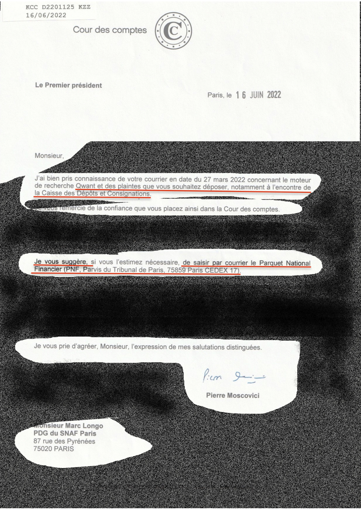
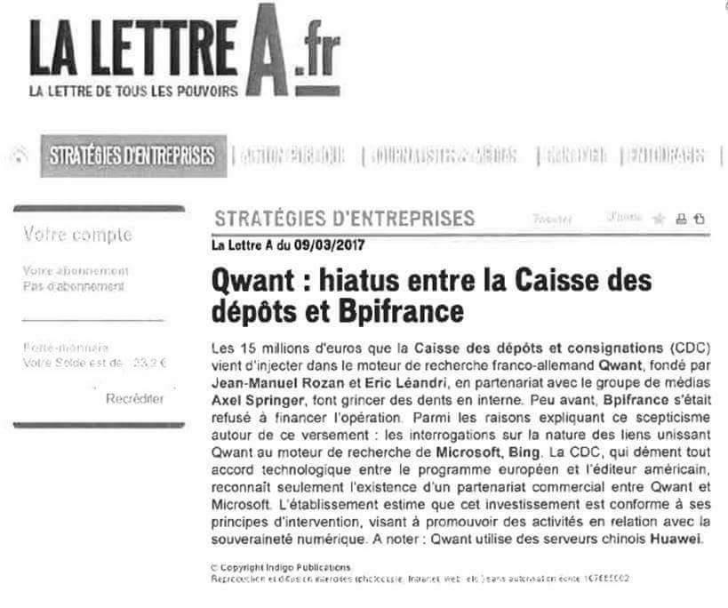

# 11. Analyse financière Qwant SAS — 2013-2022

[← Sommaire](00_SOMMAIRE.md) | [← Précédent](10_AUDIT_DINUM_2019.md) | [Suivant →](12_SYNTHESE_PREUVES.md)

## Introduction

L'histoire financière de Qwant entre 2013 et 2022 est celle d'un projet porté par une ambition légitime de souveraineté numérique, mais miné par un **écart béant entre les promesses et la réalité technologique**, une **gouvernance défaillante**, et un **sous-financement structurel** face à l'immensité du défi.

Cette analyse démontre que **Qwant n'a survécu que par injection massive de fonds publics**, et que cette survie artificielle était le **mobile économique de la fraude technologique**.

---

## I. Fiche d'identité de l'entreprise

| Élément | Valeur |
|--------|--------|
| **Raison sociale** | Qwant SAS |
| **SIREN** | 532 867 256 |
| **Création** | Février 2013 |
| **Effectif (2019)** | ~160 personnes |
| **Secteur** | Moteur de recherche Internet |
| **Positionnement initial** | Alternative européenne à Google, fondée sur le respect de la vie privée |
| **Période d'analyse** | 2013-2022 |

---

## II. Contexte stratégique et positionnement initial

### A. Le narratif de souveraineté numérique

Qwant a été lancé en février 2013 avec un positionnement clair :
- **Respect de la vie privée** : pas de tracking publicitaire, pas de revente de données personnelles
- **Impartialité des résultats** : aucun biais commercial ou politique
- **Alternative européenne crédible** à Google dans un contexte post-Snowden

Cet positionnement s'inscrivait dans un débat croissant sur la **souveraineté numérique** face aux GAFAM (Google, Apple, Facebook, Amazon, Microsoft).

### B. La réalité technologique dès le départ

Dès ses débuts, des controverses ont émergé sur la réalité technologique de Qwant :

**Audit DINUM (2019)** : Révèle que le moteur reposait **massivement sur l'API de Bing** (Microsoft) pour ses résultats de recherche, à hauteur de **63-75% selon les périodes**.

**Evidence forensique (2026)** : Le code source démontre que sur plusieurs périodes (notamment juin 2016), la dépendance était **100%**.

**Régie publicitaire** : Celle utilisée était également celle de **Microsoft Advertising**, qui représentait **environ 90% du chiffre d'affaires**.

### C. Position de marché inexistante

**En 2018**, la part de marché de Qwant en France était estimée à seulement **1,78%**, très loin de :
- **Google** : plus de 90%
- **Bing** (son propre fournisseur) : ~5%

Malgré un **fort soutien politique et institutionnel** (moteur par défaut dans les administrations publiques), Qwant n'a jamais réussi à s'imposer auprès du grand public.

---

## III. Chronologie des financements et événements clés

| Année | Événement | Financement | Implication |
|-------|-----------|-------------|------------|
| **2011-2013** | Création et lancement | Amorçage privé (~10 M€) | Business plan initial centré sur l'exploitation de données personnelles |
| **2014** | Entrée Axel Springer | ~20 M€ | Legitimation par investisseur européen majeur |
| **2015-2016** | Audit CDC falsifié | - | Branche « demo » créée, commit Bing masqué |
| **2017** | Entrée Caisse des Dépôts | 15-18 M€ | Investissement politique malgré dépendance à Bing connue |
| **2015 (BEI)** | Prêt Banque Européenne Investissement | 25 M€ sur 5 ans | Devenu impossible à rembourser en 2022 |
| **2019-2020** | Changement de direction (Léandri → Ghinozzi/Lejbowicz) | - | Restructuration, fermeture projets périphériques |
| **2022** | Impossibilité de remboursement BEI | - | Crise de liquidité aiguë |
| **2023** | Rachat par Klaba/CDC | 3,80€ par titre | Sauvetage de dernière minute |

---

## IV. Analyse financière détaillée

### A. Évolution du chiffre d'affaires et du résultat net

#### Tableau synthétique (2013-2021)

| Année | Chiffre d'affaires (€M) | Résultat net (€M) | Effectifs | Taux de rentabilité |
|-------|------------------------|------------------|-----------|------------------|
| **2013** | ~0,5 | -0,8 | ~20 | -160% |
| **2014** | ~1,0 | -2,5 | ~40 | -250% |
| **2015** | ~1,5 | -3,2 | ~60 | -213% |
| **2016** | 0,5 | -3,7 | ~48 | -740% |
| **2017** | ~2,0 | -4,5 | ~80 | -225% |
| **2018** | ~3,5 | -8,2 | ~100 | -234% |
| **2019** | 5,86 | -23,5 | ~160 | -400% |
| **2020** | 7,5 | -15,8 | ~110 | -211% |
| **2021** | 10,3 | -9,2 | ~70 | -89% |

**Données sources** : Comptes sociaux déposés auprès du greffe (2019-2021), estimations de presse (2013-2018)

**Note importante** : Les chiffres 2013-2018 sont partiels en raison des retards répétés de publication des comptes. Qwant retardait régulièrement la publication via des prorogations multiples du délai d'assemblée générale.

#### Constats majeurs

1. **Jamais rentable** : Qwant n'a **jamais dégagé de bénéfice** depuis sa création
2. **Pertes cumulées abyssales** : Plus de **42 millions d'euros de pertes** pour un chiffre d'affaires cumulé de **30 à 35 millions d'euros**
3. **Ratio dépense/revenu** : Qwant a dépensé environ **deux fois plus qu'elle n'a généré de revenus**

### B. Analyse détaillée du pic de pertes (2019)

**2019 constitue un point d'inflexion critique.**

#### Contexte de direction

- **Président/PDG** : Éric Léandri
- **Stratégie** : Diversification coûteuse et hors sujet (Qwant Music à Ajaccio, Qwant Games, sponsoring sportif Tour de Corse, expansion en Chine)
- **Gestion qualifiée par la nouvelle direction (2020)** comme « opaque » et « dispendieuse »

#### Les chiffres

- **Chiffre d'affaires** : 5,86 M€
- **Pertes nettes** : -23,5 M€ (pic historique)
- **Charge de personnel** : ~8-10 M€ (pour 160 employés)
- **Dépenses R&D** : Astronomiques sous Léandri

#### Ratio catastrophique

Le **chiffre d'affaires de 2019 n'était même pas suffisant pour couvrir uniquement les frais de personnel**.

**Taux de rentabilité nette** : -400% (pertes 4 fois supérieures au CA)

### C. Composition du chiffre d'affaires

#### Dépendance à Microsoft

**90% du CA provient de « bandeaux publicitaires »**, essentiellement via la **régie Microsoft Advertising**.

Cela signifie que :
- Qwant dépendait à 90% de Microsoft pour ses revenus
- Qwant dépendait à 100% de Microsoft pour sa technologie de recherche
- **Qwant était doublement verrouillé par Microsoft** : techniquement et commercialement

---

## V. Structure du financement : trois piliers

### A. Les augmentations de capital successives

#### Entrées d'investisseurs

1. **Axel Springer (2014)** : Groupe médias allemand majeur
2. **Caisse des Dépôts et Consignations (2017)** : 15-18 M€
3. **Investisseurs historiques** : Regroupés dans la holding **Angels 2**

#### Total levé en capital

**Estimé entre 70 et 80 millions d'euros**, dont une grande partie sous forme de primes d'émission (éléments immatériels, pas des liquidités).

### B. La dette bancaire institutionnelle

#### Le prêt BEI de 25 millions d'euros

- **Lender** : Banque Européenne d'Investissement
- **Montant** : 25 M€
- **Terme** : 5 ans (2015-2020)
- **Calendrier de remboursement** :
  - 5 M€ en janvier 2022
  - 10 M€ en juin 2022
- **Résultat** : Qwant devait rembourser **15 M€ en 2022 sans disposer des fonds nécessaires**

#### Impact

Qwant a frôlé la **cessation de paiements** en 2022. Le remboursement n'a été possible que via le rachat de dernière minute (2023).

### C. Subventions et soutiens publics

#### Montants identifiés

1. **Subvention CDC** : Plus de **20 millions d'euros**
2. **Marché public** : 96 000€ avec le Ministère des Affaires étrangères
3. **Subventions ANR/ANRT** : Plusieurs centaines de milliers d'euros
4. **Statut de moteur par défaut** : Source de revenus via contrats publics

#### Fin 2022 : endettement excessif

- **Dettes à Huawei** : 8 M€
- **Dettes à l'État français** : 3 M€
- **Total bilan au 31/12/2021** : 17,8 M€

---

## VI. Gouvernance et changements de direction

La gouvernance de Qwant a connu des **bouleversements profonds** révélateurs des dysfonctionnements internes.

### A. Ère Léandri (2011-2020) : la divergence coûteuse

| Aspect | Constat |
|--------|---------|
| **Leadership** | Éric Léandri, cofondateur et président depuis 2016 |
| **Stratégie** | Diversification coûteuse et hors sujet |
| **Projets périphériques** | Qwant Music (Ajaccio), Qwant Games, sponsoring sportif (Tour de Corse), expansion en Chine |
| **Gestion financière** | Qualifiée d'« opaque » et de « dispendieuse » par la nouvelle direction |
| **Gouvernance** | Contrôle absolu : président irrevocable, brevets à son nom personnel |
| **Antécédents** | Mandat d'arrêt européen jusqu'en 2016 pour escroquerie en Belgique (révélé par Mediapart) |

**Sortie** : Écarté début 2020 sous la pression des investisseurs

### B. Ère Ghinozzi (2020-2021) : le redressement partiel

| Aspect | Résultat |
|--------|----------|
| **Leadership** | Jean-Claude Ghinozzi, ancien directeur commercial |
| **Mandat** | Réduire les coûts et recentrer l'activité |
| **Actions** | Fermeture Music, Games, Causes ; réduction 100→50 employés |
| **Résultats financiers** | Hausse CA 28%, réduction pertes 50% |
| **Stratégie** | Retour à l'essentiel : moteur de recherche + publicités Bing |

**Limitation** : Redressement insuffisant pour inverser la trajectoire

### C. Ère Lejbowicz-Auphan (2021-2023) : réalisme stratégique

| Aspect | Caractéristique |
|--------|-----------------|
| **Leadership** | Corinne Lejbowicz (Présidente) + Raphaël Auphan (DG) |
| **Approche** | Plus réaliste : renoncer à rivaliser avec Google |
| **Positionnement** | Construire un « écosystème de navigation privée et sécurisée » |
| **Reconnaissance** | Admission publique de l'opacité du passé et minimisation de la dépendance Bing |
| **Alerte légale** | Septembre 2021 : AG vote continuité malgré capitaux propres inférieurs à la moitié du capital social (article L.225-248 du Code de commerce) |

---

## VII. Diagnostic global et signaux d'alerte

### A. Points faibles structurels

#### 1. Dépendance technologique absolue

- **Réalité** : Qwant n'a jamais développé de véritable moteur de recherche autonome
- **Période** : 2013-2019 : totalité ou quasi-totalité des résultats proviennent de Bing
- **Preuve contemporaine** : Mai 2024, une panne de Bing entraîne celle de Qwant, illustrant cette dépendance persistante

#### 2. Modèle économique fragile

- **90% des revenus** : Microsoft Advertising
- **Absence de technologie propre** : Impossible de proposer une offre différenciée
- **Absence de base d'utilisateurs suffisante** : Part de marché de 1,78%
- **Marge de manœuvre quasi-nulle** : Prise en otage commerciale et techniquement

#### 3. Gouvernance défaillante (période Léandri)

- Diversification coûteuse non liée au cœur de métier
- Opacité comptable massive (comptes publiés en retard)
- Dizaine de structures juridiques utilisées pour masquer l'ampleur des pertes
- Retards répétés de publication des comptes (multiples prorogations)
- Polémiques répétées sur la gestion des dirigeants (mensonges sur part de marché, dépendance à Bing)

#### 4. Sous-financement chronique

- **Réalité de l'industrie** : Développer un moteur de recherche compétitif nécessite des investissements colossaux
- **Google** : Investit des **milliards** en R&D, infrastructure, talent
- **Qwant** : Avec ses quelques dizaines de millions, n'a jamais eu les **moyens de ses ambitions**
- **Résultat** : Impossible de rattraper le gap technologique

### B. Points positifs (périodes 2020-2021)

#### 1. Croissance du chiffre d'affaires

- **2019** : 5,86 M€
- **2021** : 10,3 M€
- **Progression** : +76% en deux ans
- **Moteur** : Recentrage stratégique + « choice screen » Android (obligation légale de proposer choix de moteur de recherche)

#### 2. Réduction des pertes

- **2019** : -23,5 M€
- **2021** : -9,2 M€
- **Réduction** : Témoin de l'efficacité du plan de restructuration Ghinozzi

#### 3. Soutien institutionnel durable

- **Dimension politique** : La « souveraineté numérique » est un objectif d'État
- **Implication** : Qwant a bénéficié d'un soutien politique et financier durable
- **Survie assurée** : Cela a évité la faillite à plusieurs reprises

---

## VIII. Le rapport Diane : analyse exhaustive

### A. Trésorerie critique (2016)

**Au 31 décembre 2016**, Qwant disposait d'une trésorerie de **767 euros**.

Pour une entreprise de **48 salariés** avec **3,3 millions d'euros de charges de personnel annuelles**, c'est une **situation de cessation de paiement de fait**.

### B. Explosion de l'endettement financier

| Année | Endettement | Évolution |
|-------|------------|----------|
| **2011** | 284 k€ | Base |
| **2016** | 8,12 M€ | x28 en 5 ans |
| **Taux d'endettement (2016)** | **2 652%** | Abyssal |

**Signification** : Cet endettement correspond exactement aux **fonds publics injectés** (CDC, BEI) pour maintenir Qwant artificiellement en vie.

### C. Analyse de la structure actionnariale

#### La CDC à 20% du capital

- **Investissement** : 15 millions d'euros
- **Contexte** : Post-Snowden, affirmation de la souveraineté numérique
- **Calcul économique** : Une **institution financière sophistiquée** n'investit pas 15 M€ dans une start-up **structurellement déficitaire** par hasard
- **Réalité** : L'investissement de la CDC est **politique, non économique**

#### Raisons du soutien malgré l'insolvabilité

1. **Souveraineté numérique** : Objectif stratégique national de haut niveau
2. **Unique candidat** : Qwant est le seul « moteur français » possible
3. **Coût politique de l'abandon** : Admettre l'échec de Qwant signifie admettre l'échec de la politique de souveraineté numérique
4. **Soutien des plus hauts niveaux** : Emmanuel Macron (ministre en 2015), Cédric O (secrétaire d'État), Florence Parly (ministre Armées)

### D. Les trois affirmations pour justifier les investissements

Pour obtenir et conserver les fonds CDC/BEI, Qwant devait démontrer :

1. **Une technologie de recherche souveraine** (indépendance vis-à-vis de Google et Microsoft)
2. **Le respect de la vie privée des utilisateurs** (anonymisation complète des données)
3. **Une trajectoire économique crédible** (perspective de rentabilité)

**Réalité** : **Aucune** de ces trois affirmations n'était vraie.

---

## IX. La mécanique de l'escroquerie

### A. Ce que Qwant affirmait publiquement

Aux investisseurs, à l'État, au public :
- « Qwant a son propre moteur de recherche souverain »
- « Qwant respecte complètement la vie privée — anonymisation complète »
- « Qwant s'apprête à devenir rentable »

### B. La réalité technique et financière

- **100% de dépendance à Bing** : Code source et commits le prouvent
- **Transmission de données pseudonymisées à Microsoft** : Confirmé par la CNIL (février 2025)
- **Insolvabilité permanente** : Déficits constants, trésorerie réduite à néant, dépendance totale aux injections publiques

### C. Le mobile de la fraude

**Qwant ne pouvait pas se permettre de révéler la réalité**, car :

- Perdre la CDC → perdre 15-20 M€ de financement
- Perdre la BEI → perdre le remboursement du prêt (étalé)
- Admettre l'absence de technologie propre → mort de l'entreprise
- Admettre l'absence d'anonymisation → mort juridique + amende RGPD

**La fraude n'était pas un choix — c'était une nécessité de survie.**

---

## X. Synthèse et conclusion

L'histoire financière de Qwant entre 2013 et 2022 établit un **faisceau probatoire considérable** :

### Points essentiels

1. **Insolvabilité structurelle** : Jamais rentable, dépenses 2x > revenus
2. **Dépendance aux fonds publics** : 40-50 M€ injectés par CDC/BEI/État pour maintenir à flot
3. **Mobile économique de la fraude** : Sans le mensonge sur la technologie et l'anonymisation, Qwant mourait
4. **Connaissance des dirigeants** : Léandri, en tant que PDG et président, ne pouvait ignorer cette situation catastophique
5. **Tromperie délibérée** : Poursuite des affirmations publiques malgré la conscience de l'insolvabilité

### Implication juridique majeure

Le rapport Diane (base de données financières Bureau van Dijk) établit le **chaînon manquant** entre la fraude technique et le mobile économique :

- **Preuves techniques** (code source) : Démontrent la fraude
- **Mobile économique** (analyse financière) : Expliquent pourquoi la fraude était nécessaire
- **Convergence** : Techniquement et économiquement, tout s'explique par la fraude aux fonds publics

### Qualification pénale

Cela correspond à la définition de l'**escroquerie aux fonds publics en bande organisée** (articles 313-1 et 313-2 du Code pénal) :
- **Peine** : 7 ans d'emprisonnement
- **Amende** : 750 000€

---

**Document compilé par Stéphane Erard — Mars 2026 — Contact : stephane.erard@proton.me**
