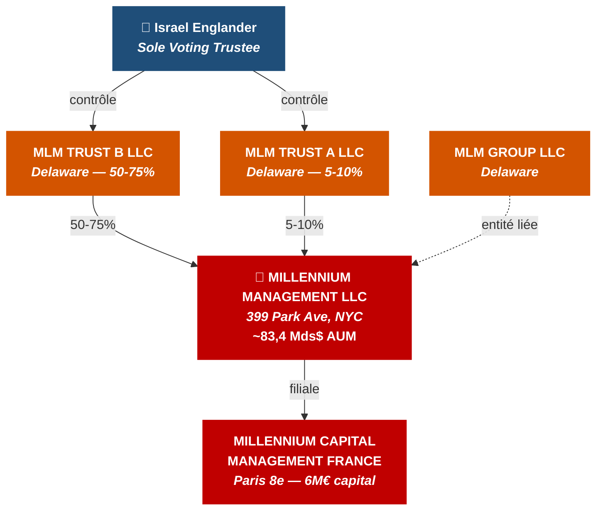
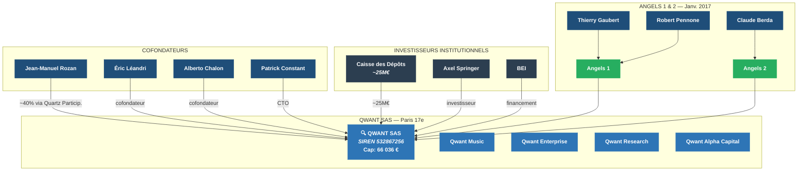
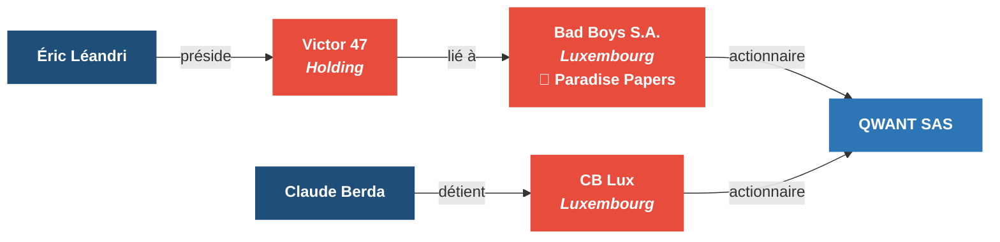
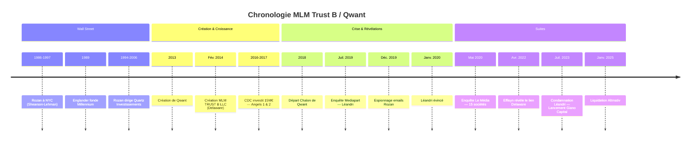

# DOSSIER D'INVESTIGATION — 14_HOLDINGS_FLUX - MLM TRUST B LLC & QWANT

> *Qui se cache derrière les BSA détenus par une société du Delaware ?*
>
> Faisceaux d'indices et analyse des connexions — **Mars 2026**
>
> ⚠️ *Document confidentiel — Usage privé*

---

## Table des matières

1. [MLM TRUST B LLC — Identification de l'entité](#1-mlm-trust-b-llc--identification-de-lentité)
2. [QWANT — Une nébuleuse de sociétés](#2-qwant--une-nébuleuse-de-sociétés)
3. [BAD BOYS SA — Le lien luxembourgeois](#3-bad-boys-sa--le-lien-luxembourgeois)
4. [ENCART SPÉCIAL — Alberto Chalon](#4-encart-spécial--alberto-chalon)
5. [Comment les BSA sont-ils arrivés chez MLM Trust B ?](#5-comment-les-bsa-sont-ils-arrivés-chez-mlm-trust-b-)
6. [Chronologie clé](#6-chronologie-clé)
7. [Schéma des connexions](#7-schéma-des-connexions)
8. [Sources](#8-sources)

---

## 1. MLM TRUST B LLC — Identification de l'entité

### 1.1 Fiche d'identité corporative

| Champ | Valeur |
|---|---|
| **Dénomination** | MLM TRUST B LLC |
| **Juridiction** | Delaware, États-Unis |
| **N° d'enregistrement** | 5481225 |
| **Date de création** | 12 février 2014 |
| **Agent enregistré** | Corporation Service Company, 251 Little Falls Drive, Wilmington, DE 19808 |
| **Adresse opérationnelle** | **399 Park Avenue, New York, NY 10022** |
| **LEI** | 549300R78UTF6ERXTZ29 |
| **Statut** | ACTIVE |
| **Entités liées** | MLM Trust B (LEI: 549300MLOP3V011E7B88), MLM GROUP LLC (n°5112198), B HOMING MLV CORP (n°5843835) |

### 1.2 Le faisceau d'indices : Millennium Management

**L'adresse révélatrice :** Le 399 Park Avenue, New York, est le siège mondial de **Millennium Management LLC**, l'un des plus grands hedge funds au monde (~83,4 milliards de dollars d'actifs sous gestion en janvier 2026), fondé en 1989 par **Israel « Izzy » Englander**.

**Le sigle « MLM » :** C'est l'abréviation interne utilisée par Millennium Management pour ses entités juridiques. Le site officiel est mlp.com (Millennium Partners). Les structures de détention portent systématiquement le préfixe « MLM » : MLM Trust A, MLM Trust B, MLM Group LLC, etc.

**La confirmation SEC :** D'après les déclarations réglementaires (Form ADV) de Millennium Management auprès de la SEC :

- **MLM Trust B LLC** détient entre **🔴 50% et 75%** de Millennium Management
- **MLM Trust A LLC** détient entre 5% et 10%
- **Israel Alexander Englander** détient entre 25% et 50% et sert de **sole voting trustee** (seul trustee avec droit de vote)

> **Conclusion :** MLM Trust B LLC est le principal véhicule de détention de Millennium Management, et **Israel Englander en est le bénéficiaire effectif ultime**.

### 1.3 Structure de détention Millennium

---

## 2. QWANT — Une nébuleuse de sociétés

### 2.1 Structure corporative opaque

Les enquêtes de Marc Endeweld (Le Média, mai 2020) et de Marc Longo (Effisyn) ont révélé un réseau d'environ **15 sociétés satellites** autour de Qwant, dont aucune ne publiait ses comptes. Cette nébuleuse comprenait 4 holdings, dont deux totalisant près de 10 millions d'euros de capital.

L'article d'Effisyn mentionne explicitement que cette nébuleuse s'étendait **jusqu'au Delaware** — où est précisément immatriculée MLM TRUST B LLC.

### 2.2 Les trois cofondateurs et leurs rôles

#### a) Jean-Manuel Rozan — L'homme de Wall Street

| Élément | Détail |
|---|---|
| **Naissance** | 1954, Genève |
| **Formation** | MBA Wharton (1980) |
| **Wall Street** | **11 ans à New York** — trader de dérivés chez **Shearson-Lehman**, puis Indosuez NY |
| **Réseau** | A côtoyé **Nassim Taleb** (trading d'options, années 1980) |
| **Hedge fund** | Fondateur de **Quartz Gestion** (1989-1991) puis **Quartz Investissements** (global macro, vendu déc. 2006) |
| **Holding Qwant** | **Quartz Participations** (42 av. Montaigne, Paris 8e) — ~40% de Qwant |
| **Rôle Qwant** | Cofondateur, Président du CA |

> **🔴 Faisceau clé :** Rozan évoluait dans le **même écosystème** que Israel Englander (dérivés, options, New York, années 1980-90). Il est le candidat le plus vraisemblable comme intermédiaire avec Millennium.

#### b) Éric Léandri — Le PDG controversé

| Élément | Détail |
|---|---|
| **Rôle Qwant** | PDG opérationnel jusqu'en janvier 2020 |
| **Condamnation Belgique** | **« Recel de titres volés »** (2005-2006) — qualifié de membre d'une **organisation criminelle** |
| **Mandat d'arrêt** | Mandat d'arrêt européen de 2011 à 2015 |
| **Holdings** | Président de **Victor 47**, liée à **Bad Boys SA** (Luxembourg, Paradise Papers) |
| **Espionnage** | Condamné en 2023 pour **violation du secret des correspondances** de Rozan (espionnage emails déc. 2019) |
| **Post-Qwant** | Startup **Altrnativ** (cybersurveillance) — liquidée en janvier 2025 pour impayés |

#### c) Alberto Chalon — Le lien avec le marché secondaire

*→ Voir [encart dédié section 4](#4-encart-spécial--alberto-chalon)*

### 2.3 Écosystème Qwant

---

## 3. BAD BOYS SA — Le lien luxembourgeois

### 3.1 Identification

| Champ | Valeur |
|---|---|
| **Dénomination** | BAD BOYS S.A. |
| **Juridiction** | Luxembourg |
| **N° RCS** | B138562 |
| **Siège** | 23, Rue Aldringen, L-1118 Luxembourg |
| **Lien ICIJ** | Identifiée dans les **Paradise Papers** |

### 3.2 Liens avec Qwant

Bad Boys SA est une société luxembourgeoise identifiée dans les **Paradise Papers** de l'ICIJ. Elle figure parmi les **premiers actionnaires de Qwant** et était associée à la holding **Victor 47**, présidée par Éric Léandri.

Léandri a tenté de minimiser ce lien, affirmant que Bad Boys SA « appartenait à l'un des petits actionnaires de Qwant » et que la Caisse des Dépôts avait été informée. Cependant, le fait que Léandri présidait Victor 47, structure liée à Bad Boys SA, contredit cette tentative de mise à distance.

> **🔴 Signification :** La présence d'une société des Paradise Papers au capital de Qwant illustre l'habitude des fondateurs à utiliser des structures offshore ou opaques (Luxembourg, Delaware) pour les montages financiers.

---

## 4. ENCART SPÉCIAL — Alberto Chalon

### ⭐ PROFIL : De Qwant au marché secondaire

| Étape | Détail |
|---|---|
| **Parcours avant Qwant** | Entrepreneur italien. Carrière dès 1996 dans la mode. Bâtit avec son frère une entreprise de 120+ employés et 150M€ CA (First Srl, thecorner.com, Goodfellas) |
| **Cofondateur de Qwant (2013)** | Directeur Général. Signe les accords avec Microsoft, Firefox, Huawei. Contribue à lever 65M€+ (Axel Springer, Caisse des Dépôts) |
| **Départ en 2018** | Quitte ses fonctions exécutives **un an avant** les scandales Mediapart. Timing notable |
| **Giano Capital (Genève)** | Fonde Giano Capital avec Andreas Wiele (ex-dirigeant média allemand). Spécialisé dans le **marché secondaire late-stage** tech européenne |
| **Stratégie Giano** | Fonds de 50M€, tickets de 2 à 25M€, durée de vie 5 ans (vs 10 habituels), cible IRR >25%. Sélection ultra-stricte : 100 sociétés screenées → 3 investissements/an |
| **Portefeuille** | SumUp, Deliveroo, Lyst, Sennder, 23andMe, Freeda, Sheertex, Audiencerate |
| **Partenariats** | Partenaire du **European Investment Fund (EIF)** — Business Angel Program |

### ⚠️ Pourquoi c'est intéressant pour l'affaire Qwant / MLM Trust B

Le nouveau métier d'Alberto Chalon — le **marché secondaire** (achat/vente de parts de startups entre investisseurs) — est **exactement** le type d'activité par lequel des BSA ou des parts Qwant peuvent changer de mains et atterrir chez un hedge fund comme Millennium.

**Trois éléments convergents :**

| # | Indice |
|---|---|
| 🔴 **1** | Chalon a quitté Qwant en 2018, mais la question de ce qu'il a fait de ses parts/BSA **reste ouverte** |
| 🔴 **2** | Son expertise en secondary deals lui donne la **compétence et le réseau** pour placer des instruments financiers (BSA) auprès de fonds institutionnels |
| 🔴 **3** | Giano Capital opère depuis **Genève**, hub de la finance internationale, avec des connexions européennes et américaines |

> *NB : Aucun lien direct documenté entre Chalon et Millennium. Il s'agit d'un faisceau d'indices fondé sur la cohérence des profils et des activités.*

---

## 5. Comment les BSA sont-ils arrivés chez MLM Trust B ?

### 5.1 Le mécanisme des BSA

Les BSA (Bons de Souscription d'Actions) sont des instruments financiers attribués par décision de l'assemblée générale d'une société. Ils donnent à leur détenteur le droit de souscrire à des actions à un prix prédéterminé. Les BSA peuvent être attribués à des employés, des partenaires ou des tiers investisseurs.

### 5.2 Les scénarios possibles

| Scénario | Description | Probabilité |
|---|---|---|
| **A — Contrepartie d'un financement** | Millennium accorde un prêt ou une ligne de crédit à Qwant (ou à l'une de ses holdings), recevant des BSA en contrepartie comme « equity kicker » | ⭐⭐⭐ |
| **B — Placement via un intermédiaire** | Jean-Manuel Rozan, fort de son réseau Wall Street, introduit Millennium. Les BSA sont attribués en AG, votée par les cofondateurs | ⭐⭐⭐⭐ |
| **C — Transaction secondaire** | Un fondateur ou investisseur existant cède des BSA à MLM Trust B sur le marché secondaire. L'expertise d'Alberto Chalon rend ce scénario crédible | ⭐⭐⭐ |
| **D — Rémunération de services** | BSA attribués en rémunération de conseil financier, introduction d'investisseurs ou structuration. Fréquent mais rarement public | ⭐⭐ |

### 5.3 Questions ouvertes

| Question | Enjeu |
|---|---|
| Quel est le **montant et les conditions** des BSA attribués à MLM Trust B ? | Qwant ne publiait plus ses comptes |
| Les BSA ont-ils été **exercés** ou sont-ils en sommeil ? | Impact sur la dilution du capital |
| Pourquoi un hedge fund de **83 milliards $** s'intéresserait à une startup déficitaire ? | Arrangement plus large ou personnel ? |
| Quel rôle a joué la **Caisse des Dépôts** dans la validation ? | Due diligence sur l'actionnariat |
| Lien avec le **départ de Chalon** en 2018 ? | Transaction secondaire post-départ ? |

---

## 6. Chronologie clé

| Date | Événement |
|---|---|
| **1986-1997** | Jean-Manuel Rozan à New York (Shearson-Lehman, Indosuez). Même écosystème qu'Israel Englander |
| **1989** | Israel Englander fonde Millennium Management à New York |
| **1994-2006** | Rozan dirige Quartz Investissements (hedge fund global macro) |
| **2013** | Création de Qwant par Léandri, Rozan et Chalon |
| **Fév. 2014** | 🔴 **Création de MLM TRUST B LLC au Delaware** |
| **2016-2017** | Caisse des Dépôts investit 15M€. Création des holdings Angels 1 & 2. Entrée de Gaubert, Berda, Pennone |
| **2018** | 🔴 **Départ d'Alberto Chalon de Qwant** — se spécialise dans le marché secondaire |
| **Juil. 2019** | Mediapart révèle le passé judiciaire de Léandri et les liens Bad Boys SA / Paradise Papers |
| **Déc. 2019** | Léandri espionne les emails de Rozan via TeamViewer |
| **Janv. 2020** | Léandri évincé de la direction de Qwant |
| **Mai 2020** | Enquête de Marc Endeweld (Le Média) sur la nébuleuse de 15 sociétés |
| **Avr. 2022** | Effisyn/Longo révèle l'extension de la nébuleuse jusqu'au Delaware |
| **Juil. 2023** | Léandri condamné (correspondances Rozan). Chalon lance Giano Capital (50M€) |
| **Janv. 2025** | Liquidation d'Altrnativ (startup de Léandri) |

---

## 7. Schéma des connexions

### 7.1 Vue d'ensemble : toutes les entités

```mermaid
flowchart TD
    classDef person fill:#1F4E79,stroke:#1F4E79,color:#fff,font-weight:bold
    classDef hedge fill:#C00000,stroke:#C00000,color:#fff,font-weight:bold
    classDef delaware fill:#D35400,stroke:#D35400,color:#fff,font-weight:bold
    classDef qwant fill:#2E75B6,stroke:#2E75B6,color:#fff,font-weight:bold
    classDef holding fill:#7D3C98,stroke:#7D3C98,color:#fff,font-weight:bold
    classDef offshore fill:#E74C3C,stroke:#E74C3C,color:#fff,font-weight:bold
    classDef investors fill:#27AE60,stroke:#27AE60,color:#fff,font-weight:bold
    classDef public fill:#2C3E50,stroke:#2C3E50,color:#fff,font-weight:bold
    classDef swiss fill:#F39C12,stroke:#F39C12,color:#fff,font-weight:bold

    subgraph MILLENNIUM["🇺🇸 MILLENNIUM MANAGEMENT — New York"]
        IE["Israel Englander<br/><i>Sole Voting Trustee</i>"]:::person
        MLMB["MLM TRUST B LLC<br/><i>Delaware — 2014</i><br/>50-75% de Millennium"]:::delaware
        MLMA["MLM TRUST A LLC<br/><i>Delaware</i>"]:::delaware
        MML["MILLENNIUM MANAGEMENT LLC<br/><i>399 Park Ave, NYC</i><br/>~83,4 Mds$ AUM"]:::hedge
        MCMF["MILLENNIUM CAPITAL<br/>MANAGEMENT FRANCE<br/><i>Paris 8e</i>"]:::hedge

        IE -->|"contrôle"| MLMB
        IE -->|"contrôle"| MLMA
        MLMB -->|"50-75%"| MML
        MLMA -->|"5-10%"| MML
        MML -->|"filiale"| MCMF
    end

    subgraph QWANT_GROUP["🇫🇷 QWANT — Paris"]
        QW["QWANT SAS<br/><i>Paris 17e</i><br/>Cap: 66 036 €"]:::qwant
        QM["Qwant Music"]:::qwant
        QE["Qwant Enterprise"]:::qwant
        QR["Qwant Research"]:::qwant
        SYNF["SYNFONIUM<br/><i>Président actuel</i>"]:::public
        QW --- QM
        QW --- QE
        QW --- QR
        SYNF -->|"préside"| QW
    end

    subgraph FONDATEURS["👤 COFONDATEURS"]
        JMR["Jean-Manuel Rozan<br/><i>Ex-Wall Street</i><br/>MBA Wharton"]:::person
        EL["Éric Léandri<br/><i>Ex-PDG, évincé 2020</i>"]:::person
        AC["Alberto Chalon<br/><i>Ex-DG, départ 2018</i>"]:::person
    end

    subgraph HOLDINGS_F["HOLDINGS FONDATEURS"]
        QP["Quartz Participations<br/><i>Paris 8e</i>"]:::holding
        V47["Victor 47"]:::holding
        GC["Giano Capital<br/><i>Genève</i><br/>Marché secondaire"]:::swiss
    end

    subgraph OFFSHORE["🏴 OFFSHORE"]
        BB["Bad Boys S.A.<br/><i>Luxembourg</i><br/>Paradise Papers"]:::offshore
        CBLUX["CB Lux<br/><i>Luxembourg</i>"]:::offshore
    end

    subgraph ANGELS["💰 ANGELS 1 & 2"]
        A1["Angels 1"]:::investors
        A2["Angels 2"]:::investors
        TG["Thierry Gaubert"]:::person
        CB["Claude Berda"]:::person
        RP["Robert Pennone<br/><i>GS Banque SA</i>"]:::person
    end

    subgraph INSTIT["🏛️ INSTITUTIONNELS"]
        CDC["Caisse des Dépôts<br/><i>~25M€</i>"]:::public
        AS["Axel Springer"]:::public
    end

    %% Liens fondateurs
    JMR -->|"détient via"| QP
    QP -->|"~40%"| QW
    EL -->|"préside"| V47
    V47 -.->|"lié"| BB
    BB -->|"actionnaire"| QW
    AC -->|"a fondé"| GC

    %% Liens Angels
    TG --> A1
    CB -->|"via CB Lux"| A2
    CB -->|"détient"| CBLUX
    RP --> A1
    A1 -->|"actionnaire"| QW
    A2 -->|"actionnaire"| QW

    %% Liens institutionnels
    CDC -->|"~25M€"| QW
    AS -->|"investisseur"| QW

    %% LIEN CLÉ : MLM TRUST B → QWANT
    MLMB ==>|"🔴 DÉTIENT DES BSA"| QW

    %% Liens supposés (pointillés)
    JMR -.->|"réseau Wall Street<br/>années 1980-90 ?"| IE
    AC -.->|"expertise secondary<br/>market ?"| MLMB
    GC -.->|"placement BSA ?"| MLMB
```

### 7.2 Légende

| Couleur | Signification |
|---|---|
| 🔵 Bleu foncé | Personnes physiques |
| 🔴 Rouge | Hedge fund (Millennium) |
| 🟠 Orange | Entités Delaware |
| 🔵 Bleu | Entités Qwant |
| 🟣 Violet | Holdings des fondateurs |
| 🔴 Rouge vif | Structures offshore (Luxembourg) |
| 🟢 Vert | Holdings Angels |
| ⬛ Gris foncé | Investisseurs institutionnels |
| 🟡 Jaune | Suisse (Giano Capital) |
| **Trait plein** | Lien documenté |
| **Trait pointillé** | Lien supposé / faisceau d'indices |
| **Trait épais** | Lien clé (BSA) |

---

## 8. Sources

### Registres corporatifs

| Source | Lien |
|---|---|
| MLM TRUST B LLC | [OpenCorporates](https://opencorporates.com/companies/us_de/5481225) |
| MLM Trust B — LEI | [LEI Register](https://lei.info/549300MLOP3V011E7B88) |
| Millennium Management — SEC | [IAPD](https://adviserinfo.sec.gov/firm/summary/158117) |
| Qwant | [Societe.com](https://www.societe.com/societe/qwant-532867256.html) |

### Enquêtes journalistiques

| Source | Lien |
|---|---|
| Qwant, boulet d'État — Le Média (mai 2020) | [Le Média](https://www.lemediatv.fr/articles/2020/revelations-qwant-boulet-detat-z-DwVYPzQymrJjlldr8t4g) |
| Scandale financier Macronie — Effisyn (avr. 2022) | [Effisyn](https://effisyn-sds.com/2022/04/06/qwant-un-nouveau-scandale-financier-pour-la-macronie/) |
| Léandri condamné — Next | [Next](https://next.ink/1749/eric-leandri-condamne-pour-violation-secret-correspondances-dun-associe-qwant/) |

### Profils

| Personne | Lien |
|---|---|
| Jean-Manuel Rozan | [Wikipédia](https://fr.wikipedia.org/wiki/Jean-Manuel_Rozan) |
| Alberto Chalon | [Giano Capital](https://www.gianocapital.com/team/alberto-chalon) |
| Éric Léandri | [Wikipédia](https://fr.wikipedia.org/wiki/%C3%89ric_L%C3%A9andri) |
| Israel Englander | [Millennium](https://www.mlp.com/people/leadership/israel-englander/) |

### Données offshore

| Source | Lien |
|---|---|
| ICIJ Offshore Leaks Database | [ICIJ](https://offshoreleaks.icij.org/) |

---

*Fin du document — Mars 2026*