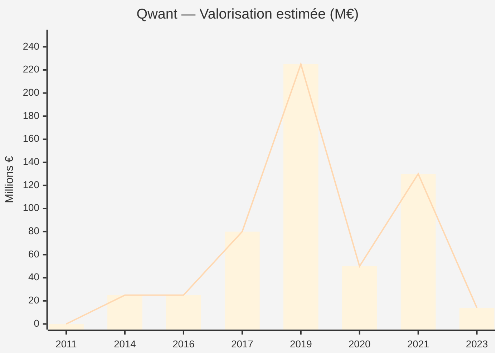
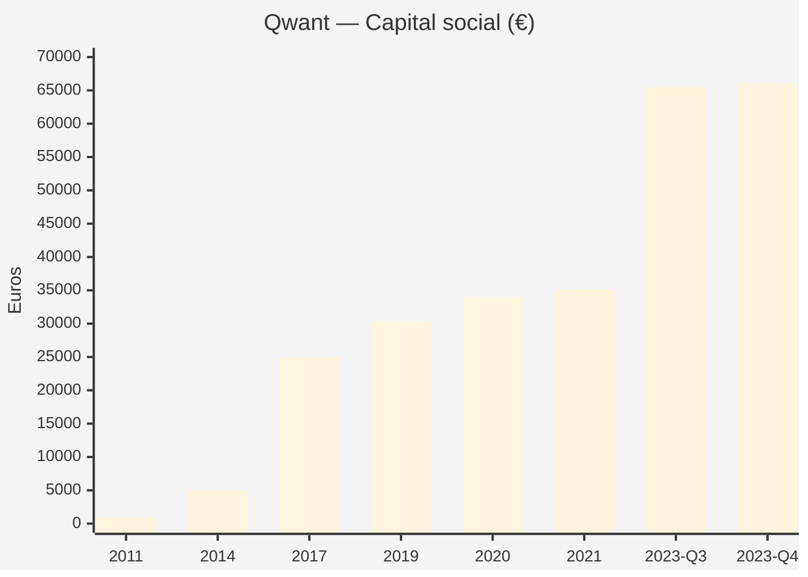

# QWANT SAS — Timeline Capital Social & Valorisation

- [QWANT SAS — Timeline Capital Social \& Valorisation](#qwant-sas--timeline-capital-social--valorisation)
  - [Vue d'ensemble : l'écart abyssal entre capital et valorisation](#vue-densemble--lécart-abyssal-entre-capital-et-valorisation)
  - [Timeline chronologique](#timeline-chronologique)
    - [2011 — Création](#2011--création)
    - [2013 — Premiers mouvements de capital](#2013--premiers-mouvements-de-capital)
    - [Février 2014 — Création de MLM Trust B LLC](#février-2014--création-de-mlm-trust-b-llc)
    - [Juin 2014 — Entrée d'Axel Springer (Série A)](#juin-2014--entrée-daxel-springer-série-a)
    - [Octobre 2016 — Prêt BEI](#octobre-2016--prêt-bei)
    - [Janvier 2017 — Création des holdings Angels](#janvier-2017--création-des-holdings-angels)
    - [Février 2017 — Levée CDC / Springer (Série B)](#février-2017--levée-cdc--springer-série-b)
    - [Août 2019 — Publication BODACC retardée](#août-2019--publication-bodacc-retardée)
    - [Été 2019 — Pic de valorisation (marché secondaire)](#été-2019--pic-de-valorisation-marché-secondaire)
    - [Janvier 2020 — Recapitalisation et changement de direction](#janvier-2020--recapitalisation-et-changement-de-direction)
    - [Avril 2020 — Publication BODACC](#avril-2020--publication-bodacc)
    - [Juillet 2020 — Augmentation de capital](#juillet-2020--augmentation-de-capital)
    - [Juin 2021 — Obligations convertibles Huawei/Hubble](#juin-2021--obligations-convertibles-huaweihubble)
    - [Juillet 2021 — Changement de direction](#juillet-2021--changement-de-direction)
    - [Juillet 2023 — Rachat Klaba / Synfonium](#juillet-2023--rachat-klaba--synfonium)
    - [21 Juillet 2023 — AG Extraordinaire historique](#21-juillet-2023--ag-extraordinaire-historique)
    - [Décembre 2023 — Dernière augmentation connue](#décembre-2023--dernière-augmentation-connue)
  - [Tableau synthétique : Évolution Capital vs. Valorisation](#tableau-synthétique--évolution-capital-vs-valorisation)
  - [Graphique Mermaid : Valorisation vs. Capital](#graphique-mermaid--valorisation-vs-capital)
  - [Analyse : les BSA dans ce contexte](#analyse--les-bsa-dans-ce-contexte)
    - [Le mécanisme de création de valeur pour un détenteur de BSA](#le-mécanisme-de-création-de-valeur-pour-un-détenteur-de-bsa)
    - [Questions ouvertes sur les BSA de MLM Trust B](#questions-ouvertes-sur-les-bsa-de-mlm-trust-b)
    - [Où trouver les réponses](#où-trouver-les-réponses)
  - [Sources](#sources)


**SIREN 532 867 256 — RCS Paris**
*Reconstitution au 6 mars 2026*

---

## Vue d'ensemble : l'écart abyssal entre capital et valorisation

Qwant présente un cas d'école de déconnexion entre capital nominal et valorisation perçue. Avec un capital social culminant à **66 036 €**, la société a été valorisée jusqu'à **225 M€** — soit un ratio de **×3 400**. Cet écart signifie que l'essentiel des fonds levés a été comptabilisé en **prime d'émission**, et que les instruments dilutifs (BSA, obligations convertibles) portent sur des montants potentiellement considérables rapportés au capital nominal.

---

## Timeline chronologique

### 2011 — Création

| Élément | Détail |
|---------|--------|
| **Date** | 25 mai 2011 |
| **Lieu** | Nice |
| **Fondateurs** | Éric Léandri, Jean-Manuel Rozan, Alberto Chalon, Patrick Constant (Pertimm) |
| **Capital initial** | Non confirmé (probablement quelques milliers d'euros) |
| **Valorisation** | ~0 (pré-revenu, pré-produit) |
| **Forme** | SAS |

---

### 2013 — Premiers mouvements de capital

| Élément | Détail |
|---------|--------|
| **Date PV** | 3 juin 2013 |
| **Événement** | Constatation d'augmentation(s) de capital par le Président |
| **Publication BODACC** | 20 août 2019 (!!) — **6 ans de retard** |
| **Capital résultant** | Non précisé à cette date |
| **Valorisation** | Inconnue |

> ⚠️ Ce PV de 2013, publié seulement en 2019, pourrait être celui qui autorise l'émission de BSA. C'est la première fenêtre temporelle plausible pour l'attribution des BSA à MLM Trust B.

---

### Février 2014 — Création de MLM Trust B LLC

| Élément | Détail |
|---------|--------|
| **Date** | 12 février 2014 |
| **Juridiction** | Delaware, USA (n° 5481225) |
| **Adresse** | 399 Park Avenue, New York (= siège Millennium Management) |
| **Bénéficiaire effectif** | Israel Englander (via structure de trust) |
| **Contexte** | Créée 4 mois avant l'entrée d'Axel Springer |

> La création de ce véhicule au Delaware juste avant la première levée significative de Qwant suggère une anticipation du deal Springer et une structuration financière en amont.

---

### Juin 2014 — Entrée d'Axel Springer (Série A)

| Élément | Détail |
|---------|--------|
| **Date** | Juin 2014 |
| **Investisseur** | Axel Springer SE |
| **Part acquise** | ~20% du capital |
| **Montant investi** | Entre 5 et 10 M€ (sources divergentes) |
| **Valorisation implicite** | |

| Hypothèse investissement | Valorisation pre-money | Valorisation post-money |
|--------------------------|----------------------|------------------------|
| 5 M€ pour 20% | **20 M€** | **25 M€** |
| 10 M€ pour 20% | **40 M€** | **50 M€** |

| **Capital social** | Non documenté précisément |
| **Source** | [Bloomberg](https://www.bloomberg.com/news/articles/2014-06-18/axel-springer-said-to-buy-stake-in-privacy-focused-website-qwant), [Abondance](https://www.abondance.com/20140620-14018-axel-springer-prend-20-du-capital-qwant.html) |

> La fourchette la plus citée est ~5 M€, ce qui donne une valorisation post-money d'environ **25 M€**. Pour un moteur de recherche sans revenus significatifs, c'est déjà un pari.

---

### Octobre 2016 — Prêt BEI

| Élément | Détail |
|---------|--------|
| **Date** | Octobre 2016 |
| **Instrument** | Prêt sur 5 ans (dette, non dilutif) |
| **Montant** | **25 M€** |
| **Prêteur** | Banque Européenne d'Investissement |
| **Impact capital** | Aucun (dette pure) |
| **Impact valorisation** | Signal de crédibilité institutionnelle |
| **Source** | [BEI](https://www.eib.org/en/stories/qwant-did-you-say) |

---

### Janvier 2017 — Création des holdings Angels

| Élément | Détail |
|---------|--------|
| **Date** | Janvier 2017 |
| **Entités créées** | **Angels 1 SAS** et **Angels 2 SAS** |
| **Investisseurs regroupés** | Gaubert, Berda, Pennone, Douste-Blazy, Cicurel |
| **Fonction** | Véhicules de pooling pour investisseurs privés |
| **Impact** | Dilution des fondateurs, entrée de personnalités politiques et business |

---

### Février 2017 — Levée CDC / Springer (Série B)

| Élément | Détail |
|---------|--------|
| **Date** | Février 2017 |
| **Montant total** | **18,5 M€** |
| **Répartition** | CDC : 15 M€ / Axel Springer : 3,5 M€ |
| **Part CDC** | ~20% du capital |
| **Part Springer maintenue** | ~20% du capital |
| **Valorisation implicite** | |

| Calcul | Résultat |
|--------|----------|
| CDC : 15 M€ pour ~20% | Pre-money **~60 M€**, post-money **~75 M€** |
| Confirmé par presse | Valorisation de **~75-80 M€** post-money |

| **Capital social à cette époque** | Non documenté (probablement ~25-30 K€) |
| **Ratio valorisation/capital** | **~×2 500 à ×3 000** |
| **Sources** | [Maddyness](https://www.maddyness.com/2017/02/03/vieprivee-qwant-leve-18-5-millions-euros/), [Next](https://next.ink/10865/103138-qwant-leve-185-millions-deuros-la-caisse-depots-prend-20-capita/), [Cambon Partners](https://www.cambonpartners.com/en/transactions/qwant-investment-from-caisse-des-dpts-axel-springer-banque-europenne-dinvestissement) |

> **Création probable des actions de préférence** (catégories A1, A2, B1, B2, C) lors de cette levée. Ces catégories sont celles qui seront converties en juillet 2023.

---

### Août 2019 — Publication BODACC retardée

| Élément | Détail |
|---------|--------|
| **Date publication** | 20 août 2019 |
| **PV enregistrés** | Du 3 juin 2013 et du 30 juin 2019 |
| **Capital résultant** | **30 417,13 €** |
| **Augmentation du 30/06/2019** | +400 € |

---

### Été 2019 — Pic de valorisation (marché secondaire)

| Élément | Détail |
|---------|--------|
| **Date** | Été 2019 |
| **Valorisation estimée** | **~225 M€** (marché secondaire interne) |
| **Capital social** | ~30 417 € |
| **Ratio valorisation/capital** | **×7 400** |
| **Contexte** | Pic avant les révélations Mediapart/Endeweld |

> ⚠️ Cette valorisation de 225 M€ sur un marché secondaire interne est le moment clé pour comprendre la valeur des BSA. Si MLM Trust B détient des BSA avec un prix d'exercice fixé en 2013-2014 (valorisation ~25 M€) et que la société est valorisée à 225 M€, la plus-value latente est de **×9**. C'est exactement le type d'opération qu'un hedge fund comme Millennium recherche.

> **Note sur Alberto Chalon** : son expertise est précisément le **marché secondaire** (Giano Capital). C'est potentiellement lui qui a facilité les transactions secondaires à cette époque.

---

### Janvier 2020 — Recapitalisation et changement de direction

| Élément | Détail |
|---------|--------|
| **Événement** | Éviction d'Éric Léandri, nomination de Jean-Claude Ghinozzi |
| **Recapitalisation** | ~10 M€ (CDC + Axel Springer) |
| **Valorisation post-crise** | En forte baisse (non chiffrée publiquement) |
| **Contexte** | Enquêtes Mediapart sur Léandri, Paradise Papers, Bad Boys SA |
| **Source** | [Usine Digitale](https://www.usine-digitale.fr/editorial/nouveau-president-recapitalisation-moteur-de-recherche-de-l-administration-un-vent-de-changement-souffle-sur-qwant.N918344) |

---

### Avril 2020 — Publication BODACC

| Élément | Détail |
|---------|--------|
| **Date publication** | 20 avril 2020 |
| **PV enregistrés** | Du 12 novembre 2015 et du 27 février 2020 |
| **Augmentations** | +3 230,70 € / +0,10 € / +0,01 € / +360,16 € |
| **Capital résultant** | **34 008,10 €** |

> Les augmentations ridicules (+0,10 €, +0,01 €) suggèrent des conversions d'instruments (BSA ?) à valeur nominale quasi-nulle, où toute la valeur est en prime d'émission.

---

### Juillet 2020 — Augmentation de capital

| Élément | Détail |
|---------|--------|
| **Augmentation** | +1 104,38 € |
| **Capital résultant** | 35 112,48 € → ajusté à **35 137,75 €** |

---

### Juin 2021 — Obligations convertibles Huawei/Hubble

| Élément | Détail |
|---------|--------|
| **Date** | Juin 2021 |
| **Instrument** | Obligations convertibles |
| **Montant** | **8 M€** |
| **Émetteur** | Hubble (fonds VC de Huawei, Hong Kong) |
| **Conversion possible** | 5% à 7,5% du capital si conversion dans 2 ans |
| **Valorisation implicite** | |

| Calcul | Résultat |
|--------|----------|
| 8 M€ pour 5% | Valorisation implicite **~160 M€** |
| 8 M€ pour 7,5% | Valorisation implicite **~107 M€** |

| **Pertes cumulées** | 47,2 M€ de pertes pour 16,3 M€ de CA (2018-2020) |
| **Source** | [Clubic](https://www.clubic.com/pro/entreprises/huawei/actualite-374772-qwant-cherche-des-financements-du-cote-de-hubble-la-branche-de-capital-risque-de-huawei.html), [Cambon Partners](https://www.cambonpartners.com/en/qwant-investment-from-huawei) |

---

### Juillet 2021 — Changement de direction

| Élément | Détail |
|---------|--------|
| **Date** | 5 juillet 2021 |
| **Départ** | Jean-Claude Ghinozzi (Président) |
| **Arrivées** | Corinne Lejbowicz (Présidente), Raphaël Auphan (DG) |
| **Capital** | 35 137,75 € (inchangé) |

---

### Juillet 2023 — Rachat Klaba / Synfonium

| Élément | Détail |
|---------|--------|
| **Date rachat** | 4 juillet 2023 |
| **Acquéreur** | Octave & Miroslaw Klaba (via **Synfonium SAS**) |
| **Structure Synfonium** | Jezby Ventures / Deep Code (Klaba) 75% + Banque des Territoires (CDC) 25% |
| **Prix d'acquisition** | **~14-15 M€** + reprise de **~40 M€ de dette** |
| **Valeur d'entreprise** | **~53-55 M€** |

| Comparaison | Valorisation |
|-------------|-------------|
| Pic été 2019 | ~225 M€ |
| Valorisation implicite OC Huawei (2021) | ~107-160 M€ |
| Prix de rachat 2023 | **~14 M€ (equity) / ~55 M€ (VE)** |
| **Destruction de valeur** | **-75% à -94%** selon la base |

| **Source** | [Developpez](https://web.developpez.com/actu/345997/), [Usine Digitale](https://www.usine-digitale.fr/article/octave-klaba-le-fondateur-d-ovhcloud-va-bien-racheter-qwant.N2147147), [Blog Economie Numérique](https://blog.economie-numerique.net/2023/07/20/rachat-de-qwant-par-octave-klaba/) |

---

### 21 Juillet 2023 — AG Extraordinaire historique

| Élément | Détail |
|---------|--------|
| **Décision 1** | Conversion de TOUTES les actions de préférence (A1, A2, B1, B2, C) → actions ordinaires |
| **Décision 2** | Augmentation de capital de **+30 306,05 €** |
| **Décision 3** | Nomination de **Synfonium SAS** comme Président |
| **Capital résultant** | **65 443,80 €** |

> La conversion des actions de préférence "nettoie" la cap table. **C'est le moment où les BSA sont soit exercés, soit annulés, soit rachetés.** Les catégories A1/A2/B1/B2/C disparaissent.

---

### Décembre 2023 — Dernière augmentation connue

| Élément | Détail |
|---------|--------|
| **Date** | 4 décembre 2023 |
| **Augmentation** | +592,93 € |
| **Capital résultant** | **66 036,73 €** (capital actuel) |

---

## Tableau synthétique : Évolution Capital vs. Valorisation

| Année | Capital social | Valorisation estimée | Ratio V/C | Événement clé |
|-------|---------------|---------------------|-----------|---------------|
| 2011 | ~quelques K€ | ~0 | — | Création |
| 2013 | N/C | N/C | — | Premier PV (publié en 2019 !) |
| **2014** | N/C | **~25-50 M€** | — | Axel Springer 20% |
| 2016 | N/C | +25 M€ dette BEI | — | Prêt BEI 25 M€ |
| **2017** | ~25-30 K€ | **~75-80 M€** | **×2 500+** | CDC 20% + Springer |
| **2019** | 30 417 € | **~225 M€** | **×7 400** | Pic marché secondaire |
| 2020 | 34 008 € | En baisse forte | — | Crise Léandri, recapitalisation |
| **2021** | 35 138 € | **~107-160 M€** | **×3 000-4 500** | OC Huawei 8 M€ |
| **2023** | 65 444 → 66 037 € | **~14 M€ equity / ~55 M€ VE** | **×210-830** | Rachat Klaba |

---

## Graphique Mermaid : Valorisation vs. Capital





---

## Analyse : les BSA dans ce contexte

### Le mécanisme de création de valeur pour un détenteur de BSA

```
Prix d'exercice BSA (fixé en 2013-2014) :
  → Basé sur valorisation ~25 M€
  → Prix par action très bas

Valorisation au pic (été 2019) :
  → ~225 M€
  → Plus-value latente : ×9

Valorisation au rachat (2023) :
  → ~14 M€ equity
  → Si BSA non exercés avant : potentiellement hors de la monnaie
  → Si exercés avant le pic : gain massif
```

### Questions ouvertes sur les BSA de MLM Trust B

| Question | Statut |
|----------|--------|
| Quand les BSA ont-ils été attribués ? | **Inconnu** — probable 2013-2014 |
| Combien de BSA ? | **Inconnu** — aucune source publique |
| Quel pourcentage du capital sur base diluée ? | **Inconnu** — le chiffre de "35%" n'est confirmé par aucune source publique trouvée |
| Prix d'exercice ? | **Inconnu** |
| Les BSA ont-ils été exercés ? | **Inconnu** — si oui, probablement avant le rachat Klaba |
| Que sont devenus les BSA lors du rachat ? | **Inconnu** — exercés, annulés ou rachetés lors de la "cleanup" de juillet 2023 |

### Où trouver les réponses

1. **Comptes sociaux 2019** (PDF sur Pappers) — L'annexe doit lister les instruments dilutifs
2. **Comptes sociaux 2020** (PDF sur Pappers) — Idem
3. **PV de l'AGE d'attribution** — Au greffe du TC Paris
4. **Statuts historiques** — Versions antérieures à 2023, au greffe ou INPI
5. **Rapport Lango/Effisyn** (219 pages) — Pourrait contenir le détail de la cap table
6. **Rapport spécial du CAC sur les BSA** — Obligatoire, déposé au greffe

---

## Sources

- [Axel Springer prend 20% de Qwant — Abondance (juin 2014)](https://www.abondance.com/20140620-14018-axel-springer-prend-20-du-capital-qwant.html)
- [Bloomberg — Axel Springer buys 20% of Qwant (juin 2014)](https://www.bloomberg.com/news/articles/2014-06-18/axel-springer-said-to-buy-stake-in-privacy-focused-website-qwant)
- [BEI — Qwant did you say? (oct. 2016)](https://www.eib.org/en/stories/qwant-did-you-say)
- [Maddyness — Qwant lève 18,5 M€ (fév. 2017)](https://www.maddyness.com/2017/02/03/vieprivee-qwant-leve-18-5-millions-euros/)
- [Next — Qwant lève 18,5 M€, CDC prend 20% (fév. 2017)](https://next.ink/10865/103138-qwant-leve-185-millions-deuros-la-caisse-depots-prend-20-capita/)
- [Cambon Partners — Qwant investment from CDC, Springer, BEI](https://www.cambonpartners.com/en/transactions/qwant-investment-from-caisse-des-dpts-axel-springer-banque-europenne-dinvestissement)
- [Clubic — Qwant / Hubble Huawei OC 8 M€ (juin 2021)](https://www.clubic.com/pro/entreprises/huawei/actualite-374772-qwant-cherche-des-financements-du-cote-de-hubble-la-branche-de-capital-risque-de-huawei.html)
- [Cambon Partners — Qwant investment from Huawei](https://www.cambonpartners.com/en/qwant-investment-from-huawei)
- [Usine Digitale — Recapitalisation Qwant 2020](https://www.usine-digitale.fr/editorial/nouveau-president-recapitalisation-moteur-de-recherche-de-l-administration-un-vent-de-changement-souffle-sur-qwant.N918344)
- [Developpez — Klaba rachète Qwant (juil. 2023)](https://web.developpez.com/actu/345997/)
- [Usine Digitale — Klaba va racheter Qwant (juil. 2023)](https://www.usine-digitale.fr/article/octave-klaba-le-fondateur-d-ovhcloud-va-bien-racheter-qwant.N2147147)
- [Blog Economie Numérique — Rachat Qwant (juil. 2023)](https://blog.economie-numerique.net/2023/07/20/rachat-de-qwant-par-octave-klaba/)
- [Pappers — Qwant (532867256)](https://www.pappers.fr/entreprise/qwant-532867256)
- [Effisyn — Qwant scandale financier (avr. 2022)](https://effisyn-sds.com/2022/04/06/qwant-un-nouveau-scandale-financier-pour-la-macronie/)

---

*Document généré le 6 mars 2026 — Données reconstituées à partir de sources publiques*
*Les valorisations sont des estimations basées sur les montants investis et les parts acquises*