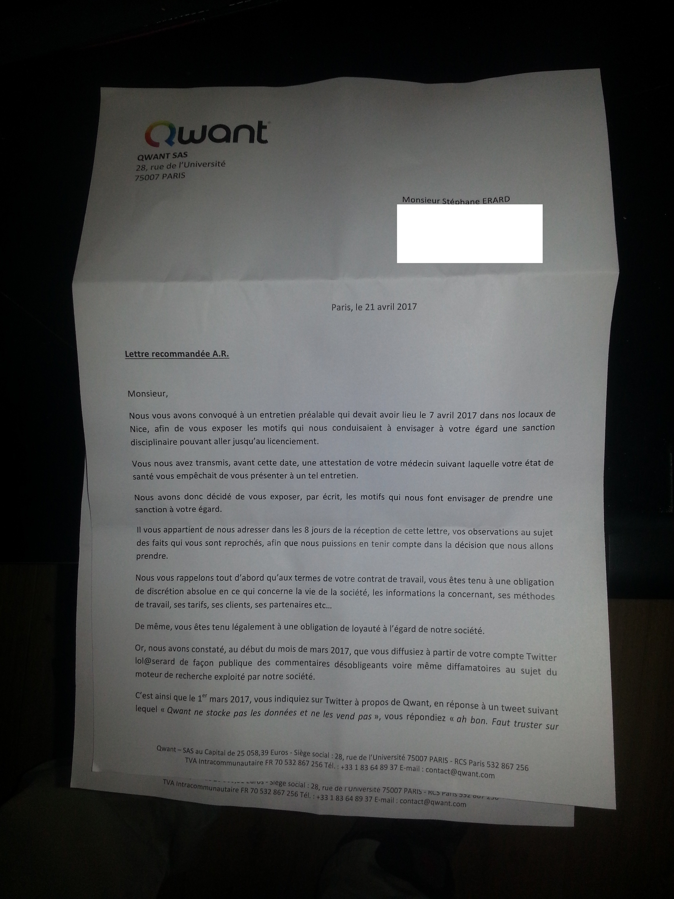

# Tribune — J'ai lancé l'alerte sur Qwant. L'État a choisi le silence.

Par **Stéphane Erard**, ingénieur informatique, ancien salarié de Qwant, lanceur d'alerte — Mars 2026

---

Il y a des mensonges qui coûtent cher. Celui de Qwant a coûté à la France vingt ans de souveraineté numérique dans le domaine de la recherche sur le web. Pas vingt ans de retard : **vingt ans de perte sèche.** Car ce qui a été détruit ne peut plus être rattrappé.

Je le sais, car je l'ai vu de l'intérieur. J'ai travaillé chez Qwant. J'ai constaté, au quotidien, que le « moteur de recherche souverain français » n'était rien d'autre qu'une façade posée sur les résultats de Microsoft Bing. J'ai vu les données de millions d'utilisateurs français partir, non anonymisées, vers les serveurs de Microsoft. J'ai alerté en interne. J'ai été licencié.

J'ai déposé plainte auprès de la CNIL en 2019. Six ans plus tard, en février 2025, la CNIL a clôturé mon dossier. **Motif : les faits sont prescrits.** En six ans, l'autorité censée protéger les données personnelles des Français n'a pris aucune sanction. Aucune. Pas même un avertissement.

J'écris aujourd'hui parce que le silence n'est plus tenable. Pas pour moi — mon cas personnel est secondaire. Mais pour ce que cette affaire révèle du fonctionnement de l'État français face à la question de la souveraineté numérique.

---

## Un simulacre de douze ans

De 2013 à 2025, Qwant a bénéficié de :
- Des financements publics massifs
- Du soutien ostensible de l'État
- D'un décret imposant son utilisation dans les administrations
- D'un déploiement dans les écoles de la République via Qwant Junior

Sa promesse était double : **une technologie souveraine** et **le respect de la vie privée.**

Les deux étaient fausses.

**La technologie n'a jamais existé.** Cent pour cent des résultats de recherche provenaient de Bing. Quant à **la vie privée, les données de recherche des utilisateurs étaient transmises à Microsoft sans anonymisation.** Chaque requête, chaque clic, chaque parcours de navigation — tout partait aux États-Unis, en clair.

### Les responsables ont menti publiquement

**Éric Léandri**, cofondateur et PDG de Qwant, a déclaré devant le Sénat que Qwant disposait de sa propre technologie. **C'était faux.**

**Cédric O**, alors secrétaire d'État au Numérique, a affirmé au Vivatech et devant le Sénat que Qwant était un moteur souverain avec une part de marché significative. **C'était faux** : la part de marché réelle n'a jamais dépassé 1 %.

**Jean-Michel Blanquer** a imposé Qwant Junior dans les écoles. Un constat d'huissier a démontré que le service traçait les enfants.

Et pendant ce temps, les responsables politiques savaient. Ils devaient savoir. Les forums spécialisés identifiaient Qwant comme un méta-moteur dès 2013. L'application Qwapp révélait la dépendance à Bing en 2015, publiquement. Mais le mensonge a été maintenus, année après année, avec le soutien ostensible de l'État.

---

## Le meurtre d'une technologie réelle

Le plus révoltant dans cette affaire n'est pas que Qwant ait menti. **C'est que l'État a laissé détruire la seule alternative réelle pendant qu'il finançait le simulacre.**

Cette alternative s'appelait **Xaphir.** Développée par la société **Xilopix**, fondée en 2008 à Épinal par Éric Mathieu, c'était une vraie technologie de recherche.

Vraie comment ? Laissez-moi être précis :
- **Trente-huit personnes**, dont **huit docteurs**
- **Sept laboratoires de recherche publics associés** : CNRS, INRIA, CEA-LIST, IMT
- **Dix millions d'euros investis sur huit ans**
- **Des brevets de rupture** en recherche visuelle et tactile
- **Un moteur opérationnel depuis mai 2017** qui, sur certaines requêtes, faisait jeu égal avec Google

C'était, à cette date, **la seule véritable technologie souveraine de recherche développée en France.**

Voici comment elle a été éliminée.

### Phase 1 : L'assèchement des financements (mai 2016)

En mai 2016, quand Xilopix a sollicité la Caisse des Dépôts pour un financement, **Gabriel Gauthey, directrice de l'investissement numérique à la CDC**, a refusé tout audit de la technologie. Il y avait, a-t-elle expliqué, une « file d'attente ».

Cette même CDC investissait au même moment dans Qwant, sur une valorisation de 70 millions d'euros pour une société qui affichait 24 millions de dette et 17 millions de pertes.

Pensez-y quelques secondes. Une technologie réelle : file d'attente, pas de financement. Un simulacre sans résultats : 70 millions d'euros.

### Phase 2 : L'audit frauduleux (20 juin 2016)

Le 20 juin 2016, un audit de Qwant a été réalisé par la société Cardiweb. Cet audit devait valider la technologie propriétaire de Qwant.

La veille de l'audit, l'API Bing a été masquée. Temporairement désactivée. Pour donner l'illusion que Qwant avait sa propre technologie.

Cet audit frauduleux a servi de base à l'investissement massif de la CDC. Cet est un document du dossier.

### Phase 3 : L'investissement massif (31 janvier 2017)

Le 31 janvier 2017, la CDC a investi dans Qwant. Montant : 70 millions d'euros de valorisation pour une société techniquement dépendante de Microsoft et financièrement exsangue.

Quelques jours avant, le 12 janvier 2017, deux structures baptisées **Angels 1 et Angels 2** avaient été créées. Soixante-six associés y ont transféré 351 895 actions Qwant, représentant 17 % du capital. Parmi eux figuraient des personnalités politiques et du monde des affaires.

La coïncidence temporelle avec la campagne présidentielle de 2017 et le rôle de Cédric O comme trésorier de LREM soulèvent des questions.

### Phase 4 : L'exécution (10 novembre 2017)

Le 10 novembre 2017, Qwant a racheté Xilopix pour **180 000 euros.**

Cent quatre-vingt mille euros pour :
- Huit ans de R&D
- Trente-huit employés
- Des brevets de rupture
- La seule technologie souveraine de recherche développée en France

Soit **1,8 % de l'investissement initial.**

Le lendemain, Xaphir a été retiré d'Internet. L'équipe a été dispersée. Les chercheurs sont partis. **Aucun audit technique n'a jamais été conduit.** On n'a pas voulu savoir ce qu'on achetait.

---

## La Caisse des Dépôts, bras armé d'une politique du simulacre

Le rôle de la Caisse des Dépôts dans cette affaire est accablant.

**D'un côté**, elle refuse d'auditer une technologie réelle (Xilopix). Excuse invoquée : une file d'attente.

**De l'autre**, elle investit dans une coquille vide (Qwant) sur la base d'un audit frauduleux — celui réalisé par Cardiweb le 20 juin 2016, au cours duquel l'API Bing avait été masquée la veille pour donner l'illusion d'une technologie propriétaire.

Les montages financiers décrits dans le dossier d'Éric Mathieu ajoutent une dimension politique à ce fiasco. Le 12 janvier 2017, deux structures baptisées Angels 1 et Angels 2 ont été créées, avec Éric Léandri comme président irrévocable. Soixante-six associés y ont transféré 351 895 actions Qwant, représentant 17 % du capital. Parmi eux figurent des personnalités politiques et du monde des affaires.

**Cette séquence — refus Xilopix, audit frauduleux Qwant, investissement CDC, création Angels, rachat Xilopix — ne relève pas de la malchance ou de l'incompétence. Elle constitue un mécanisme.**

---

## La CNIL, ou l'art de ne rien faire

Ma plainte auprès de la CNIL a été déposée en 2019. Elle portait sur un fait précis, vérifiable, et grave : **la transmission de données personnelles de recherche à Microsoft sans anonymisation ni consentement des utilisateurs.**

Ce fait est documenté techniquement. Il est attesté par :
- Des captures d'écran
- Des logs
- Des analyses réseau

Six ans plus tard, la réponse de la CNIL tient en un mot : **prescription.**

Aucune enquête approfondie. Aucune sanction. Aucun signalement au parquet. Des millions d'utilisateurs français, dont des enfants via Qwant Junior, ont vu leurs données personnelles envoyées aux États-Unis pendant des années, et la seule réponse de l'autorité de régulation est que c'est trop tard pour agir.

On peut difficilement imaginer signal plus décourageant pour les futurs lanceurs d'alerte.

---

## Ce qui reste à faire

Je ne demande ni vengeance ni réparation personnelle. Je demande la vérité et la responsabilité.

### Premièrement : une commission d'enquête parlementaire

Portant sur :
- L'utilisation des fonds publics versés à Qwant
- Le rôle de la Caisse des Dépôts dans l'élimination de Xilopix
- Les déclarations publiques des responsables politiques qui ont garanti la souveraineté d'une technologie qui n'existait pas

### Deuxièmement : la reconnaissance de mon statut de lanceur d'alerte

Conformément à la **loi Sapin II** et à la **directive européenne 2019/1937** sur la protection des lanceurs d'alerte.

### Troisièmement : la réouverture du dossier CNIL

La prescription d'une infraction ne fait pas disparaître l'infraction. Les faits sont documentés. Ils méritent au minimum d'être officiellement établis, même si la sanction n'est plus possible.

---

## Une question d'intérêt général

Cette affaire dépasse largement mon cas personnel ou même celui de Qwant. **Elle pose la question de la capacité de l'État français à évaluer, financer et contrôler les projets technologiques dans lesquels il investit l'argent des contribuables.**

Alors que l'Europe multiplie les discours sur la souveraineté numérique, alors que l'intelligence artificielle redéfinit l'accès à l'information et que les géants américains consolident leur monopole, il est urgent de comprendre comment un tel fiasco a été possible.

Non pour punir, mais **pour que cela ne se reproduise pas.**

Car le prochain Xaphir — la prochaine équipe de chercheurs français qui développera une technologie de rupture — mérite mieux qu'un rachat à 180 000 euros et une dissolution silencieuse.

---

## Qui je suis

Je suis **ingénieur en informatique.** Ancien salarié de Qwant, j'ai lancé l'alerte sur la dépendance totale de l'entreprise à Microsoft Bing et sur la transmission de données non anonymisées.

J'ai été licencié en 2021.

J'ai déposé plainte auprès de la CNIL en 2019.

Aujourd'hui, en mars 2026, je rends public l'intégralité de mon dossier de plus de 200 pages parce que le silence n'est plus tenable.

Pas pour moi. Pour la suite. Pour que les lanceurs d'alerte ne soient pas seuls face au mensonge d'État.

---

## Navigation

**Précédent :** [02 Chronologie](./02_CHRONOLOGIE.md) | **Suivant :** [04 Audit CDC](./04_AUDIT_CDC_2016.md) | **Sommaire :** [00 Sommaire](./00_SOMMAIRE.md)

---

Document compilé par **Stéphane Erard** — Mars 2026 — Contact : stephane.erard@proton.me
